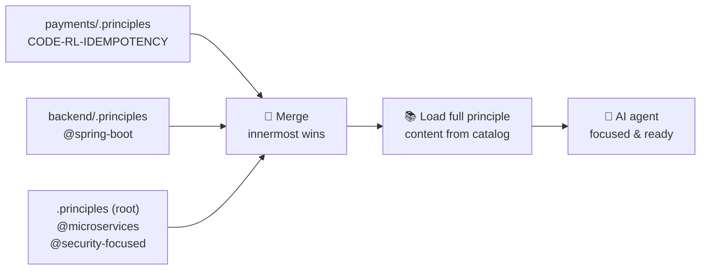
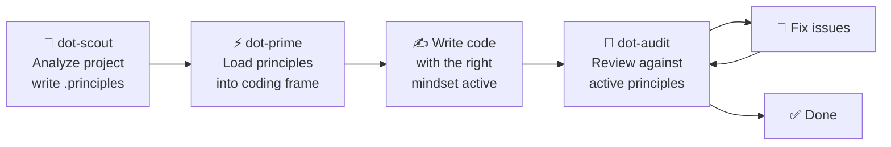

# .principles

[](https://opensource.org/licenses/MIT) [](https://creativecommons.org/licenses/by-sa/4.0/) [](https://github.com/dot-principles/dot-principles/releases)

**Select the engineering principles you want your AI agent to apply — for code, docs, infrastructure, configuration, schemas, and pipelines.**

A curated catalog of engineering principles, organized into a `.principles` hierarchy that projects declare to guide AI-assisted work across all "X as Code" artifact types.

> See [DISCLAIMER.md](DISCLAIMER.md) — this is a proof of concept. Groups are opinionated, gaps exist, and adjustments are expected.

> 🎬 **New here?** See the [live demo walkthrough](demo/presentation.md) for a quick tour.
>
> 📦 **Latest release:** [v0.11.0](https://github.com/dot-principles/dot-principles/releases/latest) — see [all releases](https://github.com/dot-principles/dot-principles/releases) and [CHANGELOG](CHANGELOG.md).

---

## 💡 Why `.principles`?

> *"The AI already knows everything. The question is: does it know what **you** care about?"*

In 2026, AI agents are genuinely impressive. Ask one to review your code and it will draw on a vast body of established software engineering knowledge:

- 🏗️ **Design** — SOLID, Gang of Four (Strategy, Observer, Factory, Decorator…), GRASP, DRY, KISS, YAGNI, Clean Code, Kent Beck's 4 Rules of Simple Design
- 🏛️ **Architecture** — Clean Architecture, Hexagonal / Ports & Adapters, DDD (Aggregates, Bounded Contexts, Repositories, Anti-Corruption Layers), CQRS, Event Sourcing, Microservices patterns, 12-Factor App
- 🔐 **Security** — OWASP Top 10, defense-in-depth, least privilege, zero-trust, secrets hygiene, secure-by-default
- ⚡ **Reliability & Performance** — circuit breakers, bulkhead, idempotency, backpressure, caching strategies, connection pooling, database indexing
- 🧪 **Testing** — test pyramid, TDD, BDD, contract testing, property-based testing, mutation testing
- ☁️ **Infrastructure** — Infrastructure as Code, immutable infrastructure, GitOps, Kubernetes patterns, observability (logs, metrics, traces)

**Knowing all of this is not the same as knowing which of it to apply.**

When an AI agent opens your file and starts writing or reviewing code — it doesn't automatically know:

- Should it scrutinize **security** here? *(Is this a payment handler or a helper utility?)*
- Should **DDD aggregates** guide this design? *(Is this a rich domain model or a thin CRUD layer?)*
- Is **backward compatibility** a hard constraint? *(Is this a public API or an internal module?)*
- Should **concurrency principles** be front-of-mind? *(Is this code on a hot, multi-threaded path?)*

Without that context, the AI picks reasonable defaults. But *reasonable defaults are not your architecture*.

**`.principles` is the bridge between what the AI knows and what it should focus on.** It doesn't teach the AI — it gives it your *intent*. And this applies not just to source code, but to any artifact type treated as code: docs, infrastructure, configuration, schemas, pipelines.

---

### 🌳 A codebase is a tree of different worlds

A real project is rarely uniform. A monorepo typically contains multiple sub-trees with entirely different stacks, concerns, and risk profiles. The `.principles` hierarchy maps directly onto that structure — just like `.gitignore`, rules cascade from the root and subdirectories can **add, narrow, or suppress**:

```
my-project/
├── .principles                    ◄ 🌐 @microservices + @security-focused
│
├── backend/
│   ├── .principles                ◄ ☕ @spring-boot  (Java · REST · DDD)
│   └── src/
│       └── payments/
│           └── .principles        ◄ 💳 CODE-RL-IDEMPOTENCY  (payment-specific scrutiny)
│
├── frontend/
│   ├── .principles                ◄ ⚛️  @react + @typescript
│   └── src/
│
├── infra/
│   └── .principles                ◄ 🏗️  CODE-AR-INFRASTRUCTURE-AS-CODE + CODE-AR-IMMUTABLE-INFRASTRUCTURE
│
└── docs/
    └── .principles                ◄ 📝 (minimal — no security scanning in prose)
```

The `backend/` team gets Spring Boot + DDD focus. The `frontend/` team gets React + TypeScript patterns. The `payments/` service gets extra idempotency scrutiny on top of everything above it. The resolution walks **up** from the file being reviewed to the git root, merging files as it goes — innermost wins:



---

### 🤖 Let the AI scout your project

You don't need to figure out which principles apply yourself. The `scout` workflow analyzes your file structure, proposes `.principles` placements, and then writes them after your confirmation. In Claude and Copilot you invoke it as `/dot-scout`; in Codex you invoke it as `$dot-scout`. It also emits per-group principle files to `.github/instructions/` and `.claude/rules/` — one file per active group, each targeting only the relevant file types:

```
/dot-scout

→ Analyzing file structure and detecting stack...
→ Detected: Spring Boot backend · React frontend · Terraform infra · Payment domain
→ Writing .principles            → @microservices + @security-focused
→ Writing backend/.principles   → @spring-boot
→ Writing frontend/.principles  → @react + @typescript
→ Writing infra/.principles     → CODE-AR-INFRASTRUCTURE-AS-CODE + CODE-AR-IMMUTABLE-INFRASTRUCTURE
→ Writing backend/src/payments/.principles → CODE-RL-IDEMPOTENCY
→ Emitting per-group files to .github/instructions/ and .claude/rules/...
→   ✓ .github/instructions/spring-boot.instructions.md   (20 principles, **/*.java)
→   ✓ .github/instructions/react.instructions.md          (18 principles, **/*.tsx, **/*.ts)
→   ✓ .github/instructions/container.instructions.md      (10 principles, Dockerfile, **/*.yaml)
→   ✓ .claude/rules/spring-boot.md                        (20 principles, **/*.java)
→   ... (14 files total)

Done ✅  Run `/dot-prime` (or `$dot-prime` in Codex) before your next coding session.
```

Of course you can also write these files manually — the format is just plain text.

---

### 🗂️ Not just code — review any artifact

`.principles` started as a code review tool, but a codebase is more than source files. READMEs, architecture docs, Terraform modules, GitHub Actions workflows, Protobuf schemas — these are all plain text in version control, and they all benefit from principled review.

The system detects the artifact type of the file being reviewed and selects the right stack of principles automatically:

| Artifact type | Examples | Principles |
|---|---|---|
| **Code** | `.java`, `.ts`, `.py`, `.go`, … | SOLID, GoF, fail-fast, input validation, DDD, concurrency, … |
| **Docs** | `README.md`, `DESIGN.md`, `ADR-*.md`, … | DOC-PURPOSE, DOC-MINIMAL, DOC-AUDIENCE, DOC-ACCURACY, … |
| **Config** | `.env`, `application.yaml`, `appsettings.json`, … | 12FACTOR-03, no hardcoded secrets, schema validation, … |
| **Infra** | `.tf`, `Dockerfile`, `Chart.yaml`, … | IaC, immutable infra, idempotency, composable modules, … |
| **Schema** | `.proto`, `.graphql`, `openapi.yaml`, `schema.sql`, … | Backward compatibility, self-describing, consistent naming, … |
| **Pipeline** | `.github/workflows/`, `Jenkinsfile`, … | Idempotency, minimal permissions, no secrets in logs, … |

Run `dot-audit README.md` and you get doc-specific findings. Run `dot-audit main.tf` and you get IaC-specific findings. The right principles fire for the right artifact — without any manual configuration.

---

### 🔄 Shift left — catch it while you're writing, not after

Traditional code review is valuable. But it happens *after* the code is already written — and the later a problem is caught, the more expensive it is to fix. Rearchitecting after the fact is painful. Rewriting after merge is costly. Finding a security flaw in production is a crisis.

`.principles` supports a **shift-left quality loop** where principles are active *before and during* coding, not just when auditing:



`dot-prime` is the key step. It resolves the full `.principles` hierarchy and loads the complete principle guidance into the AI's context *before* a single line is written. The AI doesn't just know the principles in the abstract — it has them front-of-mind as it generates code, the same way an experienced senior developer does when they sit down to work.

`dot-audit` then gives you the gut-check: not just "does this compile?" or "are there obvious bugs?" — but *"does this code reflect good engineering?"* Critical findings need immediate attention. But you also want the broader signal: is this code well-structured, secure, maintainable, and consistent with the architecture? That's quality assurance, not just bug hunting.

---

### 🧬 Transferring the developer mindset

Here is the deeper insight behind this project.

A great senior developer doesn't consult a checklist before every line they write. They have internalized principles over years of experience — SOLID, clean boundaries, security hygiene, failure modes. That internalized knowledge shapes *how they think* while coding. It's a **mindset**, not a procedure.

AI agents are already technically capable of producing correct, working code. That's not the bottleneck. The bottleneck is that they tend to generate code that *works* without necessarily generating code that is *well-principled* — unless the principles are made explicit.

`.principles` is how you make them explicit. You are not configuring a linter. You are not writing more rules. You are **transferring the mindset** of a principled software engineer to the AI agent working on your codebase.

> 🎯 The AI writes the code. You bring the craft.

---

## 🧠 Philosophy

`.principles` does **not** teach the AI anything — modern agents already know SOLID, OWASP, DDD, and the rest. It **focuses and triggers** that knowledge: giving the AI context about *which* principles matter for *this* codebase and artifact type. See [DESIGN.md §1](DESIGN.md#️-1-overview) for the full architectural rationale.

## ⚙️ How it works

Place a `.principles` file in your project root (and optionally in subdirectories) to declare which principles apply:

```
# Activate all Spring Boot principles (includes java)
@spring-boot

# Add a specific principle
CODE-OB-SERVICE-LEVEL-OBJECTIVES

# Suppress a principle for this subtree
!CODE-API-HATEOAS
```

The system walks up from the reviewed file to the git root, collecting `.principles` files and merging them (outermost first, innermost last). The AI then reads the full principle content before coding or reviewing.

### 🗂️ Layer model

Each artifact type has its own stack of layers in `layers/<type>/`. Within each stack:

| Layer                       | When                          | What                                                                               |
|-----------------------------|-------------------------------|------------------------------------------------------------------------------------|
| **Universal (cross-stack)** | Always, for all types         | DRY · KISS · YAGNI · Naming · Reveals Intention · ADR |
| **Layer 1 — Universal**     | Always, for the matched type  | Non-negotiable principles for that artifact type (e.g., code: SOLID, fail-fast; docs: DOC-PURPOSE, DOC-MINIMAL) |
| **Layer 2 — Contextual**    | Based on content signals      | API design, concurrency, data modeling, tutorial vs. reference docs, etc.          |
| **Layer 3 — Risk-elevated** | Based on risk signals         | Security, performance, backward compatibility (code and infra stacks only)         |

### 🛠️ Three commands

Because these are AI commands — not CLI tools — you speak to them in natural language. No need to specify exact file paths unless you want to. The AI understands context.

- 🔭 **`dot-scout`** — `/dot-scout` in Claude/Copilot, `$dot-scout` in Codex. Detects language/framework/domain, creates `.principles` files, then emits per-group principle files to `.github/instructions/` (Copilot Code Review) and `.claude/rules/` (Claude Code).
- ⚡ **`dot-prime`** — `/dot-prime` in Claude/Copilot, `$dot-prime` in Codex. Resolves your `.principles` hierarchy (using per-group files fast path), loads full principle guidance, prepares your coding frame.
- 🔎 **`dot-audit`** — `/dot-audit` in Claude/Copilot, `$dot-audit` in Codex. Resolves your `.principles` hierarchy (using per-group files fast path), loads principle content, reviews code, and groups findings by severity (Critical / High / Medium / Low).

The AI figures out the scope from context:

```
# Claude / Copilot (use $dot-audit / $dot-prime in Codex):
/dot-audit current changes          → reviews only what has changed since last commit
/dot-audit the payment module       → reviews the payments subtree
/dot-audit                          → you decide the scope in conversation
/dot-prime                          → loads principles for whatever you're about to work on

# Force specific principles (ignores .principles files):
/dot-audit DDD on src/orders        → review src/orders against DDD principles
/dot-audit src/orders --with ddd    → same, flag syntax
/dot-audit @ddd src/orders          → same, group-prefix syntax
/dot-audit clean-arch, solid on src → multiple groups, comma-separated
```

## 🚀 Quick start

**Prerequisites:** Bash 4+ — see [REQUIREMENTS.md](REQUIREMENTS.md) for platform-specific setup. Tested with Claude Haiku 4.5, GPT-4.1, and GPT-5.1-mini (low). Premium models recommended for best review quality and formatting. Local LLMs not supported.

```bash
# Clone the repo
git clone https://github.com/dot-principles/dot-principles.git

# Install into your project (Claude Code commands + Copilot files + Codex skills + vendor catalog)
./install.sh all <project-dir>

# Commit the installed files so every team member gets the commands automatically
cd <project-dir>
git add .claude/ .github/ .agents/ .principles-catalog/
git commit -m "Add .principles AI commands and principle files"

# Use it — in Claude Code, Copilot, or Codex:
#   /dot-scout                      → detect profile, create .principles files, emit per-group files
#   /dot-prime                      → before writing code
#   /dot-audit current changes      → review only what changed since last commit
#   /dot-audit directory            → review whatever you describe in conversation
#   /dot-audit DDD on src/          → force DDD principles regardless of .principles files
#   $dot-scout / $dot-prime / $dot-audit    → same workflows in Codex CLI or IDE
```

**GitHub Copilot (VS Code / JetBrains / CLI):** The repo ships with `.github/prompts/` and `.github/skills/` already populated — `/dot-scout`, `/dot-prime`, and `/dot-audit` are available in Copilot Chat (IDE) and Copilot CLI (terminal) as soon as you clone.

**Codex (CLI + IDE):** The repo also ships with `.agents/skills/` populated — use `$dot-scout`, `$dot-prime`, and `$dot-audit` in Codex.

To install into your own project:

```bash
./install.sh all <dir>
```

See [INSTALL.md](INSTALL.md) for full platform instructions (Linux, macOS, Windows) and all supported tools.

### ➕ Corporate & personal principles

Plug in your own principles alongside the built-in catalog — no fork needed. Create an extra catalog directory following the same structure as `principles/`, then register it:

```bash
# Register for all your projects (user-level)
echo ~/acme-principles >> ~/.principles-extra

# Or per-project
echo /shared/acme-principles >> my-project/.principles-extra

# Or on the CLI
./install.sh vendor my-project --extra-catalog ~/acme-principles
```

Corporate and personal catalogs work simultaneously — just list both in `~/.principles-extra`. See [INSTALL.md §9](INSTALL.md#9-corporate--personal-principles) for the full setup guide. A starter template lives in [`templates/extra-catalog/`](templates/extra-catalog/). A complete working example lives at [`github.com/dot-principles/example-catalog`](https://github.com/dot-principles/example-catalog) (Plain-Text-as-Code namespace).

## 📚 Principle catalog

**375 principles across 32 namespaces** — `CODE-*`, `SOLID-`, `GOF-`, `DDD-`, `GRASP-`, `OWASP-`, `12FACTOR-`, `EIP-`, `SEC-ARCH-`, `ARCH-`, `INFRA-`, `CD-`, `PIPELINE-`, `SCHEMA-`, `CONFIG-`, `DOC-`, `FP-`, `A11Y-`, `SIMPLE-DESIGN-`, `CLEAN-ARCH-`, `PKG-`, `EFFECTIVE-JAVA-`, and more. See [DESIGN.md §2](DESIGN.md#-2-catalog-structure) for the full namespace reference and [DESIGN.md §7](DESIGN.md#-7-groups) for the 53 shipped groups.

Many principles include **code examples and diagrams** to make the guidance concrete.

## 💡 Example review output

> **Note:** The output below is illustrative. Formatting, structure, and level of detail will vary between AI models and even between runs of the same model. The principle review itself is performed by the AI — some models produce thorough, well-structured audits; others may miss findings or deviate from the template. The `audit-output.json` file is the most reliable artefact; the text report is best-effort.

```
Audit complete — 4 findings.

Critical:

- `C:/projects/app/UserRepository.java:47` [CODE-SEC-VALIDATE-INPUT] — SQL query built with string concatenation; user input interpolated directly into query string. → Use parameterized queries (PreparedStatement).

High:

- `C:/projects/app/OrderService.java:23` [CODE-CC-SYNC-SHARED-STATE] — Shared mutable state without synchronization; counter field modified across request threads. → Use AtomicInteger or move state into request scope.

Medium:

- `C:/projects/app/PaymentClient.java:61` [CODE-RL-IDEMPOTENCY] — Non-idempotent retry path; charge() called in retry loop with no idempotency key. → Pass a stable idempotency key so retries do not double-charge.

Low:

- `C:/projects/app/OrderService.java:89` [CODE-DX-NAMING] — Abbreviated name obscures intent; variable named `flg` with no indication of purpose. → Rename to something that expresses what the flag controls.

Summary: 1 critical, 1 high, 1 medium, 1 low
Principle source: .principles hierarchy (2 files)

Generated: C:/projects/app/audit-output.json
```

## 🔧 Extending with your own principles

Fork this repo and add a `principles/corp/` namespace (or any name) for corporate or domain-specific principles. Reference them with `CORP-0001` in your `.principles` files. See [DESIGN.md](DESIGN.md#-11-adding-a-new-namespace) for the full process.

## 🤝 Contributing

See [CONTRIBUTING.md](CONTRIBUTING.md) for requirements, process, and source guidelines.

## 📄 License

- **Principle texts:** [CC BY-SA 4.0](https://creativecommons.org/licenses/by-sa/4.0/) — use freely, credit required, share-alike
- **Scripts and tooling:** [MIT](https://opensource.org/licenses/MIT)
- **How to apply this in practice:** see [LICENSE-INTERPRETATION.md](LICENSE-INTERPRETATION.md) for internal use vs distribution, and what users/developers may do and must do
- **Ownership boundary:** see [LICENSE-INTERPRETATION.md](LICENSE-INTERPRETATION.md) (section 10: Ownership and curation scope)

## ☕ Support

If this project is useful to you, you can support ongoing maintenance and updates:

[](https://buymeacoffee.com/flemming.n.larsen)

If the image does not load, use this link: [Buy me a coffee](https://buymeacoffee.com/flemming.n.larsen)
