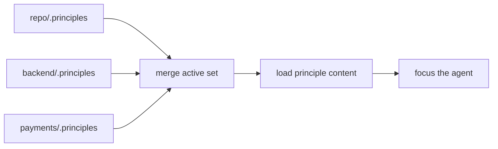

# How It Works

`.principles` works by separating three concerns:

- the **catalog** of available principles
- the **selection files** that activate them in a repo
- the **agent commands** that resolve and apply them

## 1. Principles live in a catalog

The catalog in this repository stores principles as Markdown, organized by namespace and grouped into reusable sets.

Examples include design, architecture, security, documentation, infrastructure, schema, and pipeline concerns.

The key point is simple: the principle text is inspectable, reviewable, and version-controlled. Nothing is hidden in a proprietary rules engine.

## 2. Projects activate principles with `.principles`

A project declares what matters by placing `.principles` files in the repo tree.

```text
my-project/
├── .principles
├── backend/
│   ├── .principles
│   └── src/payments/.principles
└── docs/.principles
```

Each file can:

- add a group such as `@spring-boot`
- activate a specific principle ID such as `CODE-RL-IDEMPOTENCY`
- suppress a principle with `!ID`
- apply directives such as `:max_principles`

That gives you a hierarchy that behaves much like `.gitignore`: broad defaults at the root, more specific intent deeper in the tree.

## 3. Resolution walks from the file to the root

When the agent works on a file, the system walks upward to the git root, collects every relevant `.principles` file, and merges them outermost first, innermost last.



This matters because real repositories are mixed environments. A docs subtree should not trigger the same rules as a payments module. A schema directory should not be reviewed like UI code.

## 4. Artifact type changes the stack

The framework does not assume everything is source code. It detects artifact type and chooses the right stack.

| Artifact type | Typical examples | What changes |
|---|---|---|
| Code | `.java`, `.ts`, `.py` | design, testing, security, reliability, domain rules |
| Docs | `README.md`, ADRs, design docs | audience, purpose, clarity, accuracy |
| Infra | `Dockerfile`, `.tf`, Helm | immutability, idempotency, least privilege |
| Config | `.env`, `application.yaml` | secrets hygiene, validation, explicitness |
| Schema | OpenAPI, GraphQL, SQL schema | compatibility, consistency, self-description |
| Pipeline | GitHub Actions, CI scripts | permissions, repeatability, log safety |

## 5. The command workflow applies the rules

- `dot-scout` helps create and refresh the hierarchy.
- `dot-prime` loads the most relevant rules before coding.
- `dot-audit` reviews the result against those rules after coding.

That is the practical loop:

```text
configure intent → load intent → write → review against intent
```

## Deep reference

For the full architecture, schema details, and resolution rules, see [`DESIGN.md`](https://github.com/dot-principles/dot-principles/blob/main/DESIGN.md).