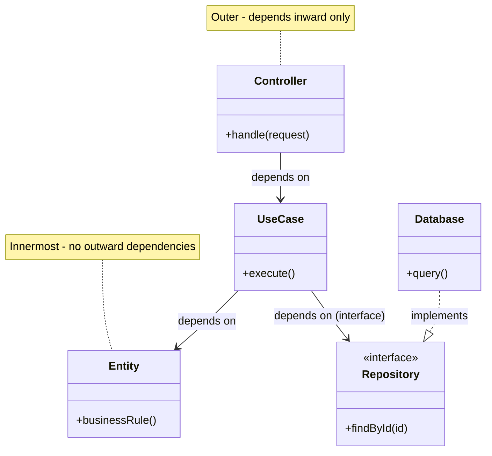

# CLEAN-ARCH-DEPENDENCY-RULE - The Dependency Rule

**Layer:** 2 (contextual)
**Categories:** architecture, maintainability
**Applies-to:** all
**Summary:** Source code dependencies must always point inward toward business rules, never outward toward frameworks or details.

## Principle

In a Clean Architecture, source code dependencies must always point inward - from outer layers (frameworks, drivers, UI) toward inner layers (use cases, entities). Inner layers define interfaces; outer layers provide implementations. Nothing in an inner circle may know anything about something in an outer circle: no function name, class name, or data format declared in an outer layer may be mentioned by code in an inner layer.

## Why it matters

The Dependency Rule is the single mechanism that makes the architecture work. When every dependency points inward, the innermost business rules are completely shielded from changes in the UI, database, or any external agency. You can replace the web framework, swap the database, or change the messaging infrastructure without touching a single line of domain or use-case code. Violating this rule - even once - couples the stable core to volatile details, undermining the entire architectural intent.

## Violations to detect

- Domain or use-case classes that import framework-specific packages (e.g., Spring, Express, Django)
- Inner-layer code that references concrete database or HTTP client implementations rather than abstractions
- Entities or use cases that depend on data transfer objects (DTOs) defined in the web or infrastructure layer
- Circular dependencies between layers, where an inner module references an outer module directly or transitively

## Good practice

- Define interfaces (ports) in the inner layer and implement them in the outer layer, using dependency inversion
- Use a composition root or dependency injection container at the outermost layer to wire implementations to interfaces
- Enforce the dependency rule with build tooling - module boundaries, package visibility rules, or architecture-test libraries (e.g., ArchUnit, Dependency Cruiser)
- Structure the project so that inner-layer modules have no compile-time dependency on outer-layer modules

## Sources

- Martin, Robert C. *Clean Architecture: A Craftsman's Guide to Software Structure and Design*. Prentice Hall, 2017. ISBN 978-0-13-449416-6. Chapter 22: "The Clean Architecture."
