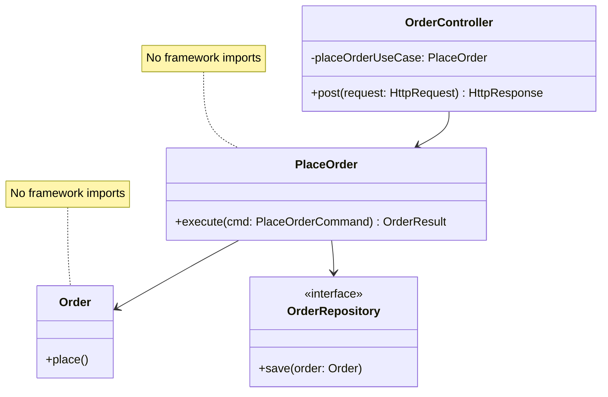

# CLEAN-ARCH-SEPARATE-BUSINESS-RULES - Separate Business Rules from Frameworks and Delivery Mechanisms

**Layer:** 2 (contextual)
**Categories:** architecture, maintainability
**Applies-to:** all
**Summary:** Keep business logic in framework-free code that can be tested without starting a web server or database.

## Principle

Business rules - the policies, validations, and calculations that define what the application does - should live in plain code with no dependencies on frameworks, databases, or UI mechanisms. The core domain logic should be expressible and testable without starting a web server, connecting to a database, or importing a framework. Frameworks are details; the business rules are the reason the software exists.

## Why it matters

When business logic is entangled with framework code, it becomes hostage to that framework's lifecycle, conventions, and limitations. Frameworks change, become unsupported, or get replaced - but business rules tend to be stable. By keeping them independent, you can test domain logic rapidly in isolation, swap delivery mechanisms (REST to GraphQL, web to CLI), and replace infrastructure without rewriting the rules that define the product's value.

## Violations to detect

- Business logic embedded in HTTP controller methods, servlet handlers, or UI event handlers
- Domain calculations that import ORM annotations, HTTP request objects, or framework-specific types
- Validation rules that can only be tested by booting the full application or framework context
- Core domain classes that extend or implement framework base classes or interfaces

## Good practice

- Place business rules in a dedicated layer or module that has no compile-time dependency on any framework
- Define domain interfaces (ports) that infrastructure code implements (adapters), keeping the dependency direction from infrastructure toward the domain
- Write unit tests for business rules that run without any framework or database - pure logic in, result out
- Treat the web framework, ORM, and message broker as plugins to the application, not the foundation of it

## Sources

- Martin, Robert C. *Clean Architecture: A Craftsman's Guide to Software Structure and Design*. Prentice Hall, 2017. ISBN 978-0-13-449416-6. Part V: "Architecture."
