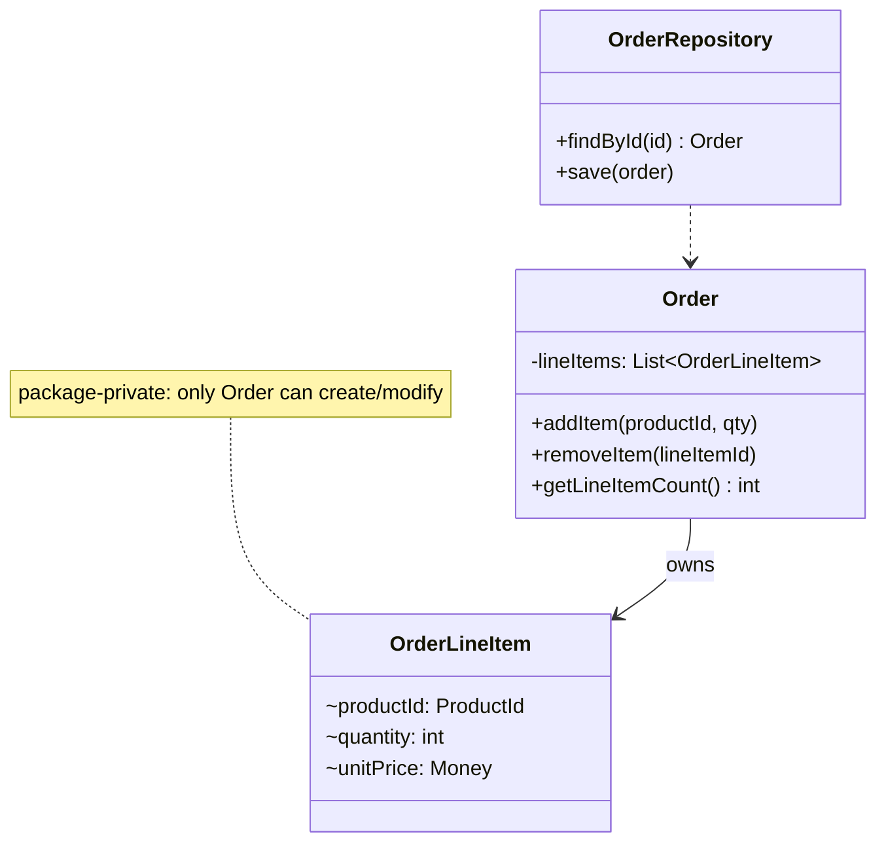

# DDD-AGGREGATE-ROOT - Aggregate Root

**Layer:** 2 (contextual)
**Categories:** domain-modeling, domain-driven-design
**Applies-to:** all
**Summary:** Route all external access and modifications to an aggregate exclusively through its single root entity.

## Principle

Every Aggregate has a single root Entity - the Aggregate Root - which is the only object through which external code may obtain references to or interact with the Aggregate's internals. Outside objects may hold references to the root but must not hold persistent references to internal Entities or Value Objects. All modifications to the Aggregate's state must go through the root, which is responsible for enforcing the Aggregate's invariants.

## Why it matters

If external code can directly access and modify internal objects within an Aggregate, it can bypass the invariant-enforcement logic concentrated in the root, leaving the Aggregate in an inconsistent state. The Aggregate Root serves as a gatekeeper that ensures every state change is validated against the business rules. Without this discipline, invariants erode and the consistency boundary becomes meaningless.

## Violations to detect

- External code that obtains a reference to an internal Entity of an Aggregate and modifies it directly, bypassing the root
- Repository methods that load or query for internal objects rather than the Aggregate Root
- APIs that expose internal Aggregate objects (e.g., returning an `OrderLineItem` from a service rather than the `Order`)
- Aggregate internals that have their own independent persistence (separate repository, separate table updates outside the root's transaction)

## Good practice



```java
// Violation - external code modifies internal entity directly
OrderLineItem item = order.getLineItems().get(0);
item.setQuantity(5);  // bypasses Order's invariant checks

// Correct - all mutations go through the Aggregate Root
order.updateLineItemQuantity(lineItemId, 5);  // root validates invariants
```

- Make internal Aggregate objects package-private or use access modifiers to prevent external code from reaching them directly
- Expose behavior on the Aggregate Root that delegates internally (e.g., `order.addLineItem(product, quantity)` instead of letting callers create and attach `LineItem` objects)
- Repositories should only provide methods to find and persist Aggregate Roots, never internal objects
- When external code needs information about an internal object, return a Value Object copy or a read-only projection rather than a live reference

## Sources

- Evans, Eric. *Domain-Driven Design: Tackling Complexity in the Heart of Software*. Addison-Wesley, 2003. ISBN 978-0-321-12521-7. Chapter 6.
