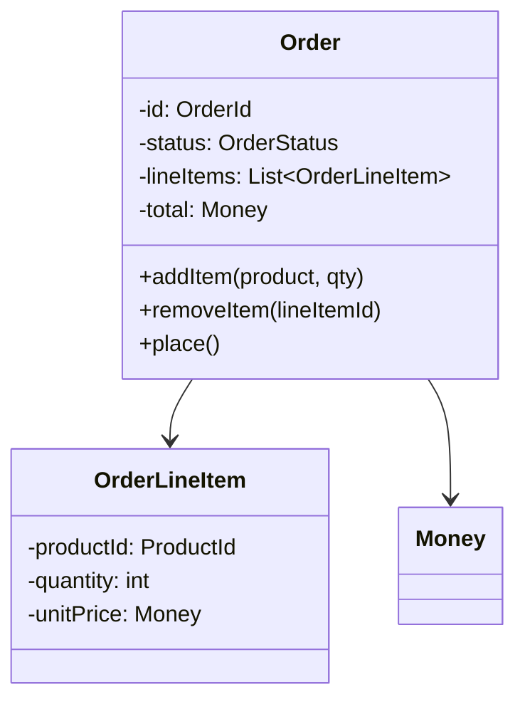

# DDD-AGGREGATE - Aggregate

**Layer:** 2 (contextual)
**Categories:** domain-modeling, domain-driven-design
**Applies-to:** all
**Summary:** Group related entities and value objects into small consistency boundaries and enforce invariants within each transaction.

## Principle

An Aggregate is a cluster of associated Entities and Value Objects that are treated as a single unit for the purpose of data changes. Each Aggregate defines a consistency boundary: invariants within the Aggregate are enforced synchronously with every transaction, while consistency across Aggregates is handled eventually. Aggregates should be designed to be as small as possible while still protecting the business invariants they encapsulate.

## Why it matters

Without clear consistency boundaries, systems either enforce too much transactional consistency (locking large object graphs, causing contention and poor scalability) or too little (allowing business rules to be violated). Well-designed Aggregates make concurrency manageable by limiting the scope of locks and transactions, and they make the domain model explicit about which invariants must hold at all times versus which can be temporarily relaxed.

## Violations to detect

- Aggregates that span many Entities and grow into large object graphs, forcing oversized transactions
- Business invariants that span multiple Aggregates and are enforced via multi-Aggregate transactions instead of eventual consistency and domain events
- Transactions that modify more than one Aggregate simultaneously (a sign that Aggregate boundaries are wrong or that cross-Aggregate consistency should be eventual)
- Aggregates with no enforced invariants, serving only as arbitrary groupings of objects

## Good practice

- Keep Aggregates small - prefer single-Entity Aggregates and use references (by ID) to other Aggregates rather than direct object references
- Identify the true invariants the Aggregate must enforce and use those to determine what belongs inside the boundary
- Use eventual consistency and Domain Events to synchronize state between Aggregates
- Each Aggregate should be loadable and savable as a single atomic unit; design your persistence around this constraint

## Sources

- Evans, Eric. *Domain-Driven Design: Tackling Complexity in the Heart of Software*. Addison-Wesley, 2003. ISBN 978-0-321-12521-7. Chapter 6.
