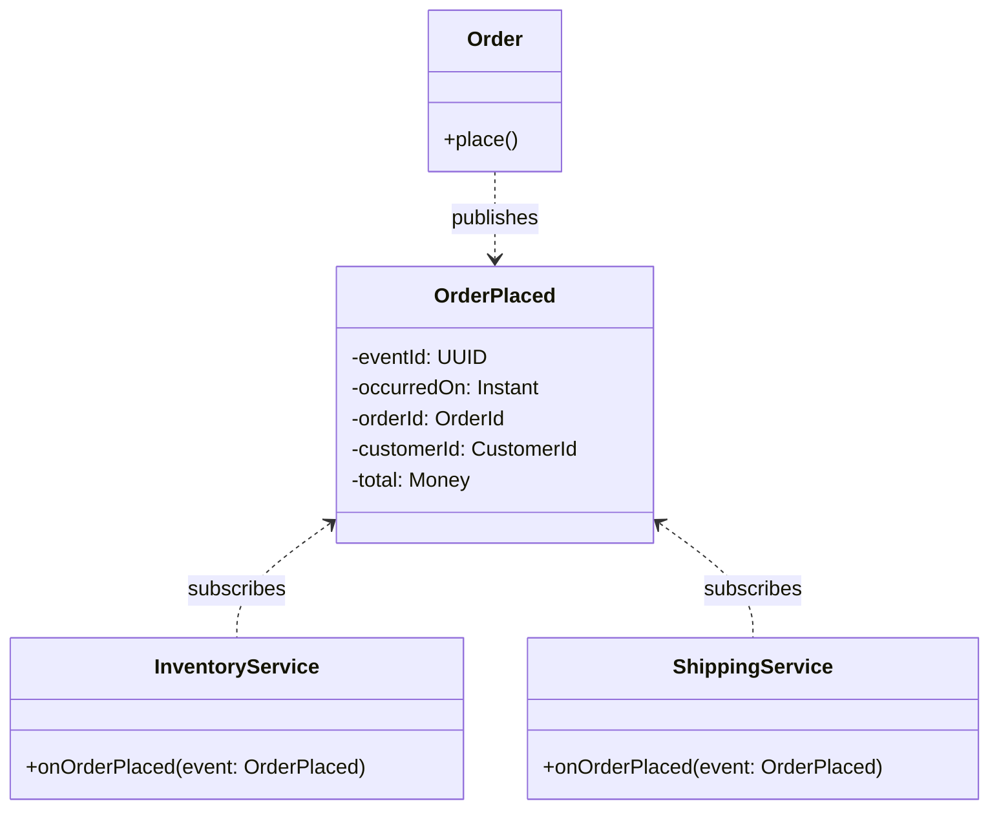

# DDD-DOMAIN-EVENT — Domain Event

**Layer:** 2 (contextual)
**Categories:** domain-modeling, domain-driven-design
**Applies-to:** all
**Summary:** Record meaningful domain occurrences as immutable past-tense events and publish them to decouple bounded contexts.

## Principle

A Domain Event is an immutable record of something meaningful that happened in the domain — expressed in the past tense and in the Ubiquitous Language (e.g., `OrderPlaced`, `PaymentReceived`, `InventoryReserved`). When something important occurs within one Bounded Context, it publishes a Domain Event that other Bounded Contexts can subscribe to and react to asynchronously. This decouples the contexts: the publisher does not need to know who the consumers are or what they do with the event.

## Why it matters

Direct synchronous calls between Bounded Contexts create tight coupling: the caller must know the callee's API, handle its failures, and coordinate transactions across boundaries. Domain Events replace this coupling with a loosely-coupled, asynchronous communication style that allows Bounded Contexts to evolve independently. They also provide an auditable history of what happened in the system, which supports debugging, analytics, and replaying state.

## Violations to detect

- Bounded Contexts making direct synchronous calls to modify each other's state rather than reacting to events
- Cross-context communication through shared mutable state (e.g., shared database tables) instead of explicit events
- Events that contain the entire state of an Entity rather than describing what happened (overloaded events that couple consumers to the producer's internal model)
- Event classes that are mutable or that lack a timestamp and identity

## Good practice



```java
// Violation — Order directly calls downstream services
class Order {
    void place() {
        inventory.reserve(this);    // tight coupling
        shipping.schedule(this);    // tight coupling
    }
}

// Correct — Order publishes an event; downstream contexts react
class Order {
    void place() {
        // ... business logic ...
        domainEvents.publish(new OrderPlaced(this.id, this.customerId, this.total));
    }
}
```

- Name events in the past tense using domain language: `OrderShipped`, `CustomerRegistered`, `SubscriptionRenewed`
- Make event objects immutable and include a unique event ID, a timestamp, and the minimal data consumers need to react
- Publish events as part of the same transaction that updates the Aggregate, using the Outbox Pattern or event-sourcing to guarantee delivery
- Design consumers to be idempotent — they should handle receiving the same event more than once without producing incorrect results

## Sources

- Evans, Eric. *Domain-Driven Design: Tackling Complexity in the Heart of Software*. Addison-Wesley, 2003. ISBN 978-0-321-12521-7. Chapter 14.
