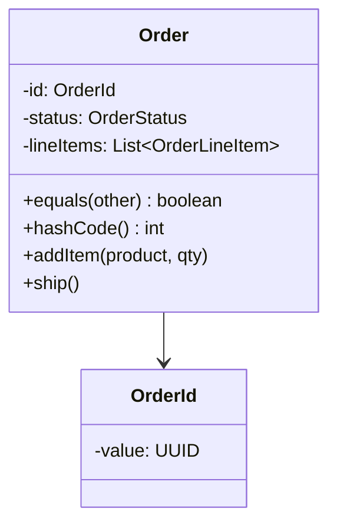

# DDD-ENTITY — Entity

**Layer:** 2 (contextual)
**Categories:** domain-modeling, domain-driven-design
**Applies-to:** all
**Summary:** Define domain objects by unique identity, not attribute values, and base equality exclusively on that identity.

## Principle

An Entity is a domain object that is defined not by its attributes but by a thread of continuity and identity. Two Entities are the same if they share the same identity, regardless of whether their other attributes differ. Entities should have a clearly defined identity mechanism (such as a unique ID) and their equality should be based on that identity, not on the values of their fields.

## Why it matters

Confusing Entities with Value Objects leads to subtle bugs: objects that should be tracked by identity get compared by value (causing duplicates or lost updates), or objects that should be interchangeable by value get tracked by identity (causing unnecessary complexity). Correctly distinguishing Entities ensures that the system accurately reflects which domain concepts persist over time and maintain continuity through state changes.

## Violations to detect

- Domain objects that clearly have identity continuity (e.g., `User`, `Order`, `Account`) but implement equality based on all fields rather than identity
- Entity classes without a defined identity field or with mutable identity fields
- Using Entity objects in sets or map keys without overriding equality to use identity
- Entities that carry so many attributes and behaviors that their core identity and lifecycle become obscured

## Good practice

- Give every Entity a clear, immutable identifier (UUID, database-generated ID, or natural business key)
- Implement `equals()` and `hashCode()` (or language equivalents) based solely on the identity field
- Keep Entities focused on identity, lifecycle, and the behaviors that require identity continuity
- Push attribute-heavy, identity-less concepts out of Entities and into Value Objects

## Sources

- Evans, Eric. *Domain-Driven Design: Tackling Complexity in the Heart of Software*. Addison-Wesley, 2003. ISBN 978-0-321-12521-7. Chapter 5.
