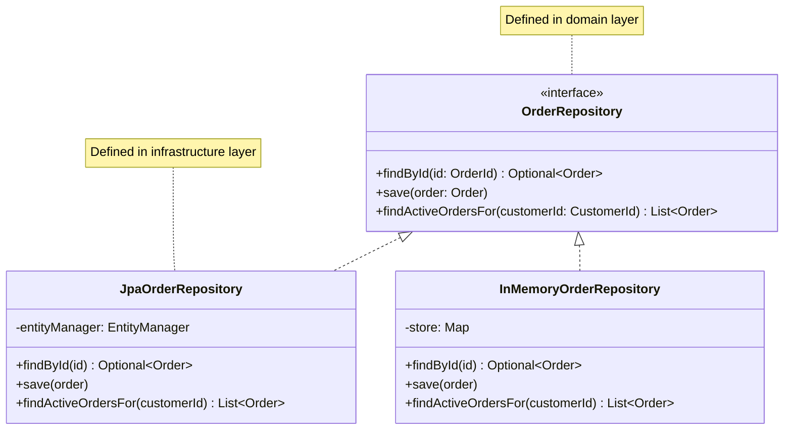

# DDD-REPOSITORY — Repository

**Layer:** 2 (contextual)
**Categories:** domain-modeling, domain-driven-design
**Applies-to:** all
**Summary:** Access and persist aggregates through a collection-like interface that hides all data-store implementation details.

## Principle

A Repository provides a collection-like interface for accessing Aggregates, encapsulating all the logic needed to store and retrieve domain objects from their underlying data store. The domain layer works with Repositories as if they were in-memory collections — adding, removing, and finding objects — without any knowledge of SQL, ORM configuration, API calls, or serialization details. This separation keeps domain logic pure and infrastructure-agnostic.

## Why it matters

When persistence logic leaks into the domain model, domain classes become coupled to specific databases, ORMs, or storage technologies. This makes the domain harder to test (requiring database setup for unit tests), harder to evolve (storage changes ripple through business logic), and harder to understand (domain concepts are obscured by infrastructure concerns). Repositories create a clean seam between the domain and its persistence infrastructure.

## Violations to detect

- Domain objects that contain direct references to database connections, ORM sessions, or HTTP clients
- Business logic methods that construct SQL queries, call REST endpoints, or manipulate file paths
- Tests of domain logic that require a running database or external service instead of an in-memory Repository stub
- Repository interfaces that expose infrastructure concepts (e.g., methods returning ORM-specific query objects, accepting SQL fragments, or exposing transaction handles)

## Good practice

- Define Repository interfaces in the domain layer, with implementations in the infrastructure layer
- Design Repository interfaces around the Aggregate Root: one Repository per Aggregate type, with methods like `findById()`, `save()`, and domain-specific finders
- Return fully reconstituted domain objects from Repositories, not raw data structures or database rows
- Use Repository interfaces as the injection point for testing: swap real implementations with in-memory fakes to keep domain unit tests fast and infrastructure-free

## Sources

- Evans, Eric. *Domain-Driven Design: Tackling Complexity in the Heart of Software*. Addison-Wesley, 2003. ISBN 978-0-321-12521-7. Chapter 6.
