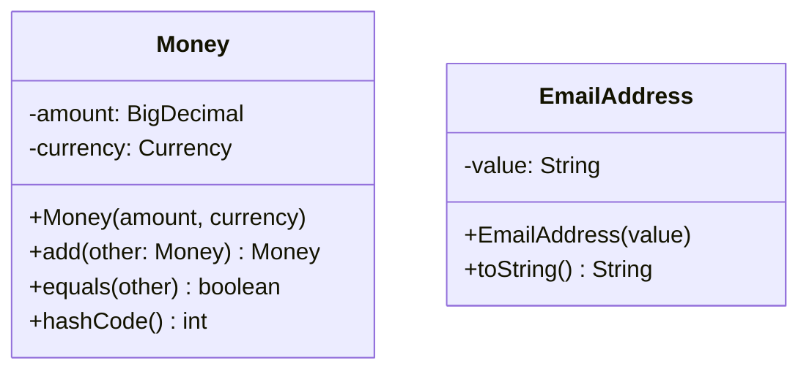

# DDD-VALUE-OBJECT — Value Object

**Layer:** 2 (contextual)
**Categories:** domain-modeling, domain-driven-design
**Applies-to:** all
**Summary:** Model descriptive domain concepts without identity as immutable objects compared by full attribute equality.

## Principle

A Value Object represents a descriptive aspect of the domain that has no conceptual identity. Two Value Objects are equal if all of their attributes are equal — there is no separate notion of "which one" they are. Value Objects should be immutable: rather than modifying a Value Object, you replace it with a new instance. Common examples include monetary amounts, date ranges, addresses, coordinates, and measurements.

## Why it matters

Treating every domain concept as an Entity adds unnecessary complexity — identity management, lifecycle tracking, and mutable-state synchronization for objects that do not need any of it. Value Objects are simpler, safer, and more expressive. Their immutability eliminates aliasing bugs (where two references to the same mutable object cause unintended side effects), and their value-based equality makes them natural candidates for caching, sharing, and use as map keys.

## Violations to detect

- Primitive obsession: using raw `String`, `int`, `double`, or `BigDecimal` for domain concepts like money, email addresses, or postal codes, instead of wrapping them in a typed Value Object
- Value-like concepts modeled as Entities with unnecessary identity fields and database-generated IDs
- Value Objects with setter methods or mutable fields
- Equality checks on Value Objects that use reference equality or identity rather than attribute comparison

## Good practice



```java
// Violation — primitive obsession
BigDecimal price = new BigDecimal("9.99");  // what currency? can be negative?
String email = "user@example.com";  // no validation, no semantics

// Correct — typed, immutable Value Objects
Money price = new Money(new BigDecimal("9.99"), Currency.USD);
EmailAddress email = new EmailAddress("user@example.com");  // validates on construction
Money total = price.add(tax);  // new instance, original unchanged
```

- Make Value Objects immutable — set all fields in the constructor and provide no setters
- Implement `equals()` and `hashCode()` based on all constituent attributes
- Provide domain-meaningful operations as methods on the Value Object (e.g., `Money.add(Money)`, `DateRange.overlaps(DateRange)`)
- Use Value Objects to replace primitive types wherever the domain assigns meaning to a value

## Sources

- Evans, Eric. *Domain-Driven Design: Tackling Complexity in the Heart of Software*. Addison-Wesley, 2003. ISBN 978-0-321-12521-7. Chapter 5.
