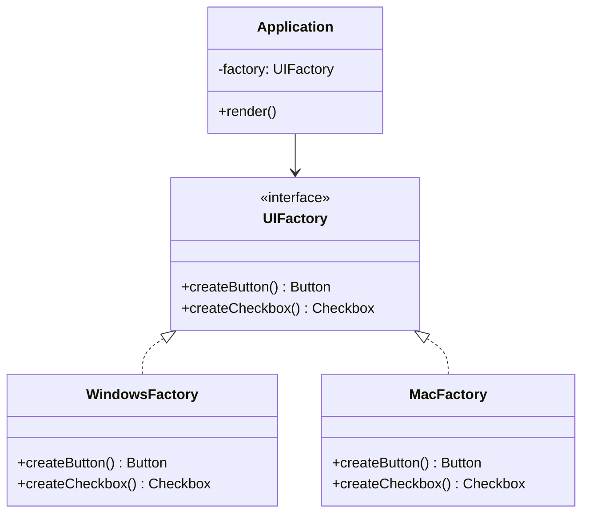

# GOF-ABSTRACT-FACTORY - Abstract Factory Pattern

**Layer:** 2 (contextual)
**Categories:** software-design, design-patterns, object-oriented
**Applies-to:** all
**Summary:** Use Abstract Factory to create families of related objects without coupling client code to concrete classes.

## Principle

Provide an interface for creating families of related or dependent objects without specifying their concrete classes. Use Abstract Factory when a system must be independent of how its products are created, composed, and represented, and when it must work with one of several families of products at a time. The pattern ensures that objects from the same family are used together while keeping client code decoupled from any particular family's implementation.

## Why it matters

Without Abstract Factory, client code that creates related objects directly becomes tightly coupled to specific product classes and must be modified whenever a new product family is introduced. Mixing objects from incompatible families causes subtle bugs that are hard to detect at compile time.

## Violations to detect

- Client code that directly instantiates concrete product classes from a family instead of going through a factory
- Conditional logic (switch/if chains) that selects which concrete class to create based on a configuration flag or platform identifier
- Inconsistent use of products from different families within the same context (e.g., mixing Windows widgets with macOS widgets)

## Good practice



```java
// Violation - directly instantiates platform-specific products
Button btn = new WindowsButton();
Checkbox cb = new WindowsCheckbox();

// Correct - factory injected; client unaware of concrete family
UIFactory factory = resolveFactory(platform);  // WindowsFactory or MacFactory
Button btn = factory.createButton();
Checkbox cb = factory.createCheckbox();
```

- Define an abstract factory interface with a creation method for each product in the family
- Implement one concrete factory per product family, ensuring all products within a factory are compatible
- Pass the factory to client code via injection so the client never references concrete product classes
- Add new families by adding a new concrete factory without modifying existing client code

## Sources

- Gamma, Erich; Helm, Richard; Johnson, Ralph; Vlissides, John. *Design Patterns: Elements of Reusable Object-Oriented Software*. Addison-Wesley, 1994. ISBN 978-0-201-63361-0. Chapter 3, Creational Patterns.
