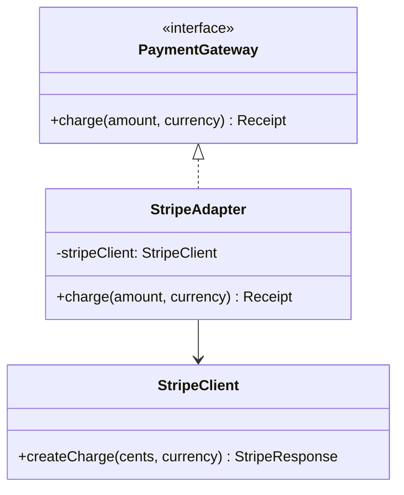

# GOF-ADAPTER - Adapter Pattern

**Layer:** 2 (contextual)
**Categories:** software-design, design-patterns, object-oriented
**Applies-to:** all
**Summary:** Use Adapter to convert an incompatible interface into one clients expect, enabling unrelated classes to cooperate.

## Principle

Convert the interface of a class into another interface clients expect. Adapter lets classes work together that could not otherwise because of incompatible interfaces. Use it when you want to use an existing class but its interface does not match the one you need, or when you want to create a reusable class that cooperates with unrelated or unforeseen classes that do not necessarily have compatible interfaces.

## Why it matters

Without Adapter, integrating third-party libraries, legacy components, or independently developed modules requires modifying either the client or the supplier, breaking encapsulation and creating maintenance burdens. Each new integration point risks introducing changes that ripple through working code.

## Violations to detect

- Client code that wraps calls to a foreign API with inline translation logic instead of isolating it behind an adapter
- Duplicated conversion or mapping code scattered across multiple call sites for the same external interface
- Direct dependence on a third-party or legacy interface throughout the codebase, making replacement costly

## Good practice



```java
// Violation - inline translation repeated at every call site
StripeClient stripe = new StripeClient();
StripeResponse r = stripe.createCharge(amount * 100, currency);

// Correct - adapter translates at the boundary; client uses the target interface
PaymentGateway gateway = new StripeAdapter(new StripeClient());
Receipt receipt = gateway.charge(amount, currency);
```

- Create an adapter class that implements the target interface and delegates to the adaptee
- Prefer object adaptation (composition) over class adaptation (multiple inheritance) for greater flexibility
- Keep the adapter thin: translate calls and data formats, but do not add business logic
- Use adapters at system boundaries (external services, legacy modules) to insulate the core domain from interface changes

## Sources

- Gamma, Erich; Helm, Richard; Johnson, Ralph; Vlissides, John. *Design Patterns: Elements of Reusable Object-Oriented Software*. Addison-Wesley, 1994. ISBN 978-0-201-63361-0. Chapter 4, Structural Patterns.
