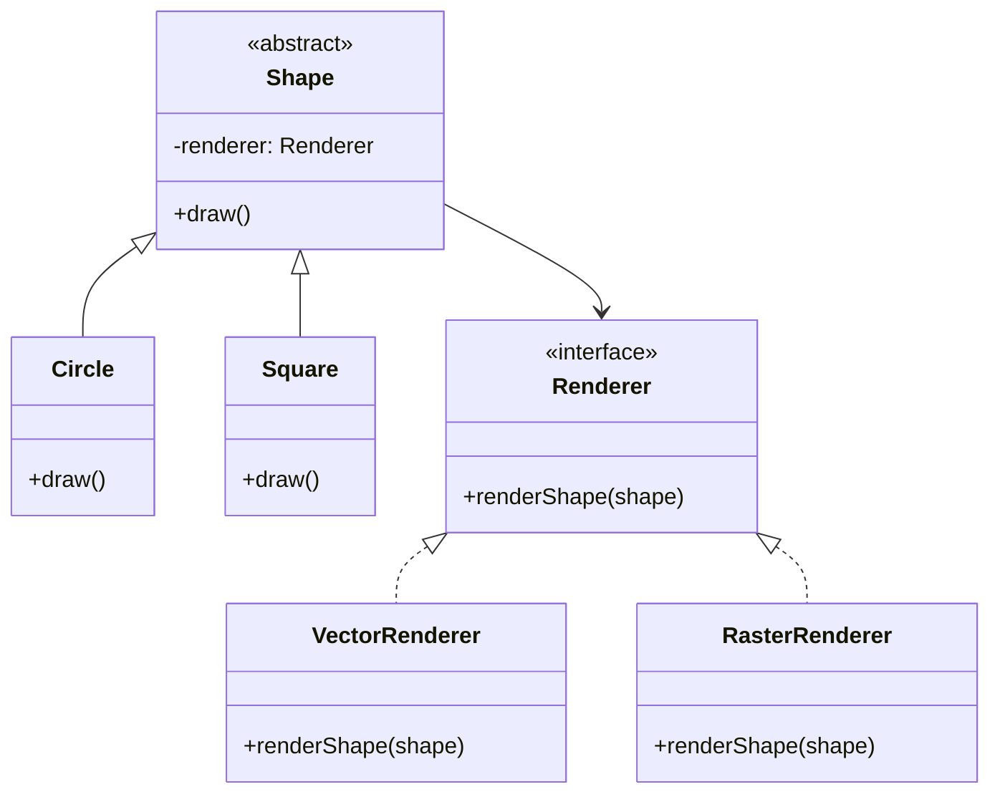

# GOF-BRIDGE - Bridge Pattern

**Layer:** 2 (contextual)
**Categories:** software-design, design-patterns, object-oriented
**Applies-to:** all
**Summary:** Decouple abstraction from implementation via composition so both can vary independently without subclass explosion.

## Principle

Decouple an abstraction from its implementation so that the two can vary independently. Use Bridge when you want to avoid a permanent binding between an abstraction and its implementation, when both the abstractions and their implementations should be extensible by subclassing, or when you see a class hierarchy that is growing in two orthogonal dimensions (e.g., shape types and rendering platforms). Bridge splits such a hierarchy into two separate hierarchies connected by composition.

## Why it matters

Without Bridge, combining multiple abstractions with multiple implementations leads to a combinatorial explosion of classes. A change in the implementation layer forces recompilation or modification of the abstraction layer and vice versa. The two dimensions of variation become entangled, making the system rigid and difficult to extend.

## Violations to detect

- A class hierarchy that multiplies subclasses along two independent axes (e.g., `WindowsButton`, `MacButton`, `WindowsCheckbox`, `MacCheckbox`)
- Implementation details exposed in the abstraction's interface, preventing alternative implementations
- Switching implementations at runtime requires restructuring the abstraction class

## Good practice



```java
// Violation - 4 classes for 2 shapes × 2 renderers
class VectorCircle {}
class RasterCircle {}
class VectorSquare {}
class RasterSquare {}

// Correct - 2 shape classes + 2 renderer classes, combined via Bridge
Renderer r = new VectorRenderer();
Shape s = new Circle(r);
s.draw();  // delegates to renderer
```

- Define the abstraction's interface separately from the implementor's interface
- Hold a reference to the implementor inside the abstraction and delegate implementation-specific work through it
- Allow the implementor to be injected or swapped at runtime without changing the abstraction
- Extend each hierarchy independently: new abstractions do not require new implementors, and new implementors do not require new abstractions

## Sources

- Gamma, Erich; Helm, Richard; Johnson, Ralph; Vlissides, John. *Design Patterns: Elements of Reusable Object-Oriented Software*. Addison-Wesley, 1994. ISBN 978-0-201-63361-0. Chapter 4, Structural Patterns.
