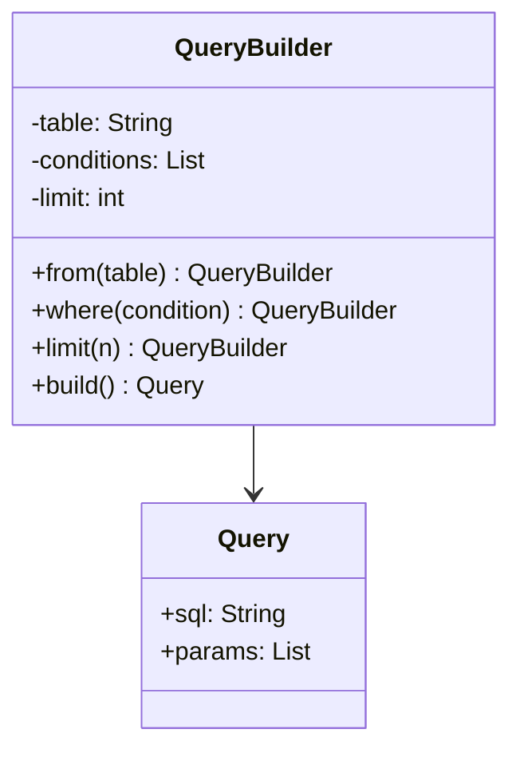

# GOF-BUILDER — Builder Pattern

**Layer:** 2 (contextual)
**Categories:** software-design, design-patterns, object-oriented
**Applies-to:** all
**Summary:** Separate complex object construction from its representation using a Builder to support multiple representations.

## Principle

Separate the construction of a complex object from its representation so that the same construction process can create different representations. Use Builder when the algorithm for creating a complex object should be independent of the parts that make up the object and how they are assembled, or when the construction process must allow different representations for the object that is constructed. The pattern is especially valuable when an object requires many optional parameters or multi-step initialization.

## Why it matters

Without Builder, constructors accumulate long parameter lists or require numerous overloads, making call sites unreadable and error-prone. Complex construction logic becomes duplicated across every place the object is created, and adding a new variant means touching all those locations.

## Violations to detect

- Constructors or factory methods with many parameters, especially when several are optional or share the same type
- Telescoping constructor chains where each overload adds one more parameter
- Duplicated multi-step object assembly logic scattered across the codebase
- Client code that must know the internal structure of a complex object to build it correctly

## Good practice



```java
// Violation — telescoping constructor
Query q = new Query("users", "age > 18", null, 10, false);

// Correct — fluent builder; only set what you need
Query q = new QueryBuilder()
    .from("users")
    .where("age > 18")
    .limit(10)
    .build();
```

- Define a Builder interface with step-by-step methods for each part of the product
- Use a Director when the construction sequence itself is reusable across different builders
- Return the builder from each setter method to support a fluent, chainable API
- Make the product immutable once built; the builder holds mutable state only during construction

## Sources

- Gamma, Erich; Helm, Richard; Johnson, Ralph; Vlissides, John. *Design Patterns: Elements of Reusable Object-Oriented Software*. Addison-Wesley, 1994. ISBN 978-0-201-63361-0. Chapter 3, Creational Patterns.
