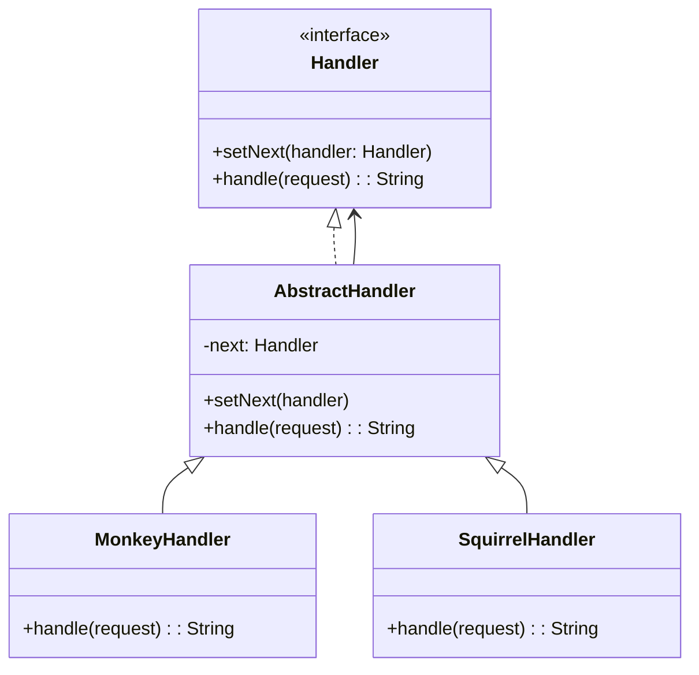

# GOF-CHAIN-OF-RESPONSIBILITY — Chain of Responsibility Pattern

**Layer:** 2 (contextual)
**Categories:** software-design, design-patterns, object-oriented
**Applies-to:** all
**Summary:** Chain handlers and pass a request along the chain until one handles it, decoupling sender from receiver.

## Principle

Avoid coupling the sender of a request to its receiver by giving more than one object a chance to handle the request. Chain the receiving objects and pass the request along the chain until an object handles it. Use this pattern when multiple objects may handle a request and the handler is not known a priori, or when you want to issue a request to one of several objects without specifying the receiver explicitly.

## Why it matters

Without Chain of Responsibility, the sender must know exactly which object can handle a given request, creating rigid dependencies. Adding or reordering handlers requires modifying the sender, violating the open-closed principle and making the request-dispatching logic brittle and hard to extend.

## Violations to detect

- Long if-else or switch chains that dispatch requests to different handlers based on type or condition
- Senders tightly coupled to specific receiver classes
- Inability to add new request handlers without modifying existing dispatching code
- Hard-coded processing order that cannot be reconfigured at runtime

## Good practice



```java
// Violation — sender knows all possible handlers
if (request.equals("Nut")) squirrel.handle(request);
else if (request.equals("Banana")) monkey.handle(request);

// Correct — chain assembled externally; sender just calls handle()
monkey.setNext(squirrel).setNext(dog);
monkey.handle(request);
```

- Define a common handler interface with a method to process the request and a reference to a successor
- Let each handler decide whether to handle the request or forward it to the next handler in the chain
- Allow the chain to be assembled and reordered at runtime for flexibility
- Accept that a request may reach the end of the chain unhandled and design for that case explicitly

## Sources

- Gamma, Erich; Helm, Richard; Johnson, Ralph; Vlissides, John. *Design Patterns: Elements of Reusable Object-Oriented Software*. Addison-Wesley, 1994. ISBN 978-0-201-63361-0. Chapter 5, Behavioral Patterns — Chain of Responsibility.
