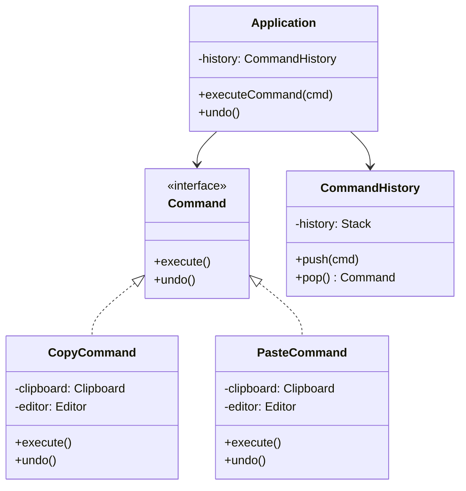

# GOF-COMMAND — Command Pattern

**Layer:** 2 (contextual)
**Categories:** software-design, design-patterns, object-oriented
**Applies-to:** all
**Summary:** Encapsulate requests as Command objects to support parameterization, queuing, logging, and undoable operations.

## Principle

Encapsulate a request as an object, thereby letting you parameterize clients with different requests, queue or log requests, and support undoable operations. It decouples the object that invokes the operation from the one that knows how to perform it. Use Command when you need to issue requests without knowing anything about the operation being requested or the receiver of the request.

## Why it matters

Without Command, invokers are directly coupled to the specific operations they trigger, making it impossible to parameterize, queue, serialize, or undo actions generically. This rigidity prevents features like macro recording, transaction logging, and multi-level undo from being implemented cleanly.

## Violations to detect

- Invoker classes that directly call domain methods instead of delegating through a request object
- Inability to undo or redo operations because actions are not captured as first-class objects
- Duplicated invocation logic when the same action must be triggered from menus, buttons, shortcuts, and scripts
- No mechanism to queue, schedule, or log operations for later execution or replay

## Good practice



```java
// Violation — invoker calls domain method directly; no undo possible
button.onClick(() -> editor.copy());  // hard to generalize or undo

// Correct — encapsulate request; invoker just calls execute()
Command copy = new CopyCommand(editor, clipboard);
history.push(copy);
copy.execute();
// Undo:
history.pop().undo();
```

- Define a Command interface with an execute method and, when needed, an undo method
- Store the receiver and all parameters needed for execution inside the command object
- Use a command history stack to implement undo and redo
- Compose macro commands from sequences of simpler commands to support compound operations

## Sources

- Gamma, Erich; Helm, Richard; Johnson, Ralph; Vlissides, John. *Design Patterns: Elements of Reusable Object-Oriented Software*. Addison-Wesley, 1994. ISBN 978-0-201-63361-0. Chapter 5, Behavioral Patterns — Command.
