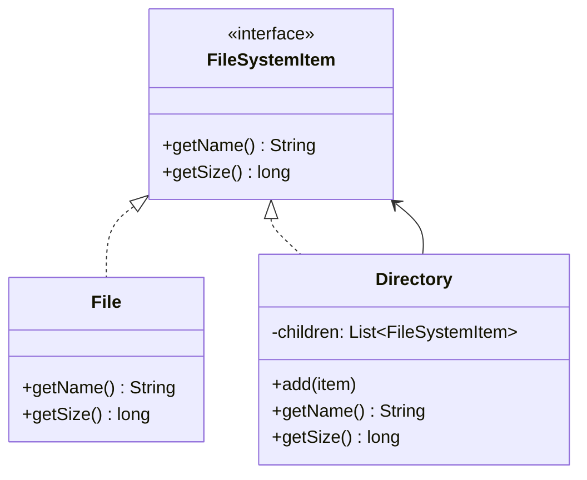

# GOF-COMPOSITE - Composite Pattern

**Layer:** 2 (contextual)
**Categories:** software-design, design-patterns, object-oriented
**Applies-to:** all
**Summary:** Compose objects into tree structures so clients treat individual objects and compositions of objects uniformly.

## Principle

Compose objects into tree structures to represent part-whole hierarchies. Composite lets clients treat individual objects and compositions of objects uniformly. Use it when you want clients to be able to ignore the difference between compositions of objects and individual objects, such as in file systems, UI widget trees, organizational charts, or arithmetic expression trees where operations should apply recursively.

## Why it matters

Without Composite, client code must distinguish between leaf and container objects with conditional logic, leading to scattered type checks and duplicated handling code. Every time a new type of leaf or composite is added, all client code that discriminates between leaves and composites must be updated.

## Violations to detect

- Client code with explicit type checks or casting to distinguish between individual items and collections of items
- Duplicated logic for processing a single element versus a group of elements
- A tree-like data structure where traversal and operations are implemented differently at each level

## Good practice



```java
// Violation - client must check type at every step
if (item instanceof Directory) {
    for (FileSystemItem child : ((Directory) item).getChildren()) { ... }
} else {
    processFile((File) item);
}

// Correct - uniform interface; client never knows if it's a leaf or composite
FileSystemItem root = new Directory("root");
root.getSize();  // recursively sums children or returns file size
```

- Define a component interface shared by both leaf and composite objects, declaring operations that make sense for both
- Composite objects store child components and implement operations by delegating to each child
- Keep the component interface as narrow as possible; avoid forcing leaf classes to implement child-management methods they do not need
- Consider whether transparency (child management in the component interface) or safety (child management only in the composite) better fits your design

## Sources

- Gamma, Erich; Helm, Richard; Johnson, Ralph; Vlissides, John. *Design Patterns: Elements of Reusable Object-Oriented Software*. Addison-Wesley, 1994. ISBN 978-0-201-63361-0. Chapter 4, Structural Patterns.
