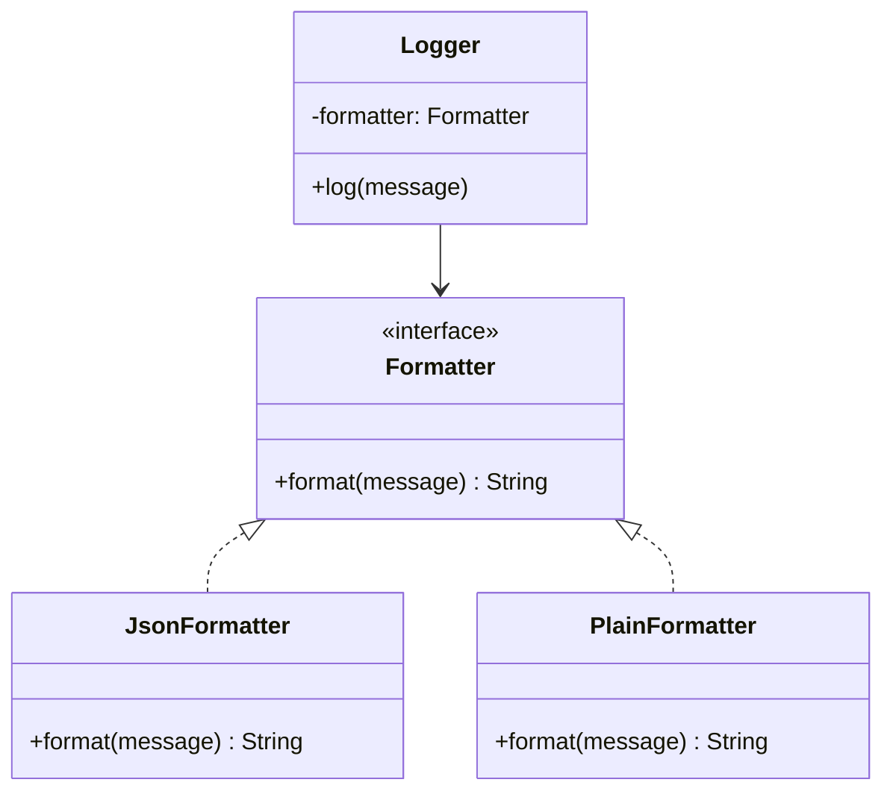

# GOF-COMPOSITION-OVER-INHERITANCE — Favor Composition over Inheritance

**Layer:** 2 (contextual)
**Categories:** software-design, design-patterns, object-oriented
**Applies-to:** all
**Summary:** Favour object composition over inheritance to keep classes focused and enable behaviour changes at runtime.

## Principle

Favor object composition over class inheritance. Inheritance breaks encapsulation by exposing a subclass to the implementation details of its parent, creating tight coupling between them. Composition assembles behavior by delegating to objects that implement well-defined interfaces, making it possible to change behavior at runtime and keep each class focused on a single responsibility. Use inheritance only when there is a genuine "is-a" relationship and the subclass truly needs to extend, not merely reuse, the parent's behavior.

## Why it matters

Over-reliance on inheritance leads to deep, rigid class hierarchies where changes to a base class ripple unpredictably through all descendants. Testing becomes difficult because subclasses cannot be understood or exercised in isolation from their parents. Composition keeps components loosely coupled, independently testable, and open to recombination in ways inheritance hierarchies cannot support.

## Violations to detect

- Deep inheritance hierarchies (more than two or three levels) used primarily for code reuse rather than true specialization
- Subclasses that override most parent methods or ignore inherited behavior
- A change to a base class that forces modifications in many subclasses
- Using inheritance to combine features that would be better represented as interchangeable components

## Good practice

Identify the behavior that varies, encapsulate it behind an interface, and inject it via composition.



```java
// Violation — inheritance to reuse formatting behavior
class JsonLogger extends BaseLogger {
    @Override
    protected String format(String msg) { return "{\"msg\":\"" + msg + "\"}"; }
}

// Correct — compose with a Formatter strategy
class Logger {
    private final Formatter formatter;
    Logger(Formatter formatter) { this.formatter = formatter; }
    void log(String msg) { System.out.println(formatter.format(msg)); }
}
```

- Identify the behavior that varies and encapsulate it behind an interface
- Compose objects by injecting collaborators rather than subclassing to acquire their behavior
- Use inheritance only for genuine type hierarchies where substitutability (Liskov) holds
- Prefer small, focused interfaces that can be mixed via delegation

## Sources

- Gamma, Erich; Helm, Richard; Johnson, Ralph; Vlissides, John. *Design Patterns: Elements of Reusable Object-Oriented Software*. Addison-Wesley, 1994. ISBN 978-0-201-63361-0. Chapter 1, Introduction.
