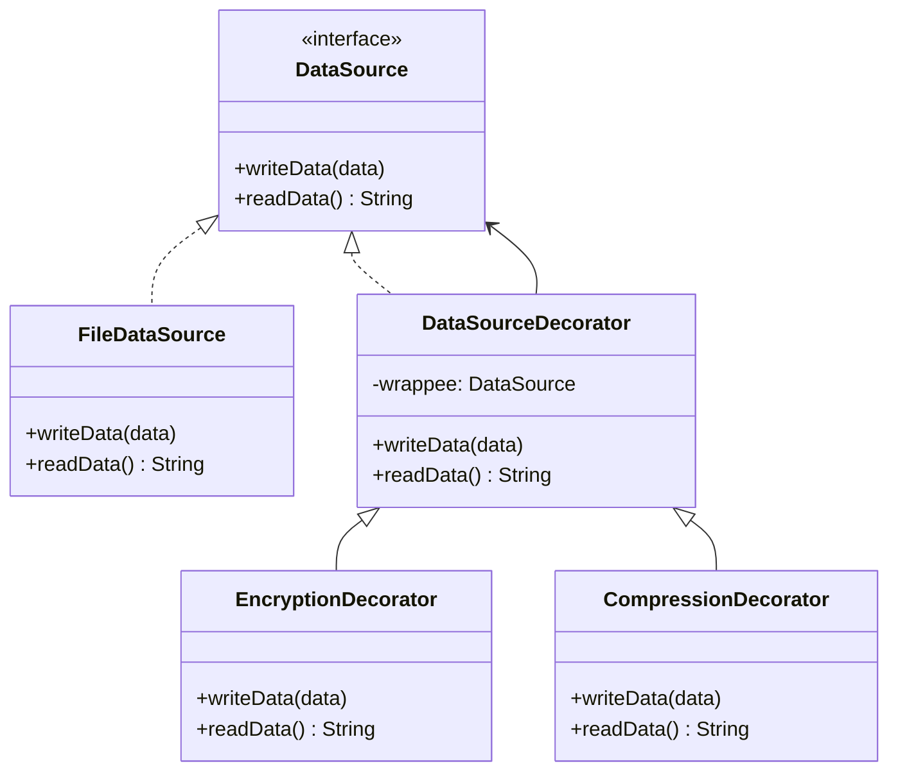

# GOF-DECORATOR - Decorator Pattern

**Layer:** 2 (contextual)
**Categories:** software-design, design-patterns, object-oriented
**Applies-to:** all
**Summary:** Attach additional responsibilities to objects dynamically via Decorator instead of creating subclass combinations.

## Principle

Attach additional responsibilities to an object dynamically. Decorator provides a flexible alternative to subclassing for extending functionality. Use it when you need to add behavior to individual objects without affecting other objects of the same class, or when extension by subclassing is impractical because it would produce an explosion of subclasses to support every combination of features.

## Why it matters

Without Decorator, adding optional features or cross-cutting concerns (logging, caching, encryption, compression) to a class requires either modifying the class directly, violating the open-closed principle, or creating a subclass for every combination of features. This leads to class explosion and rigid hierarchies that cannot be recombined at runtime.

## Violations to detect

- A class hierarchy with subclasses for every combination of optional features (e.g., `BufferedEncryptedCompressedStream`)
- Boolean flags or configuration parameters inside a class that toggle features on and off with conditional branches
- Cross-cutting behavior (logging, authorization, caching) hard-coded into core business classes instead of being wrapped around them

## Good practice



```java
// Violation - new subclass for every combination
class EncryptedCompressedFileDataSource extends FileDataSource { ... }

// Correct - stack decorators at runtime
DataSource source = new CompressionDecorator(
                        new EncryptionDecorator(
                            new FileDataSource("data.bin")));
source.writeData(payload);
```

- Define a component interface and have both the concrete component and the decorator implement it
- Each decorator holds a reference to a component and delegates core behavior to it, adding its own behavior before or after
- Stack decorators to combine features: `new Logging(new Caching(new Service()))` composes behavior without subclassing
- Keep each decorator focused on a single responsibility so they remain independently composable and testable

## Sources

- Gamma, Erich; Helm, Richard; Johnson, Ralph; Vlissides, John. *Design Patterns: Elements of Reusable Object-Oriented Software*. Addison-Wesley, 1994. ISBN 978-0-201-63361-0. Chapter 4, Structural Patterns.
