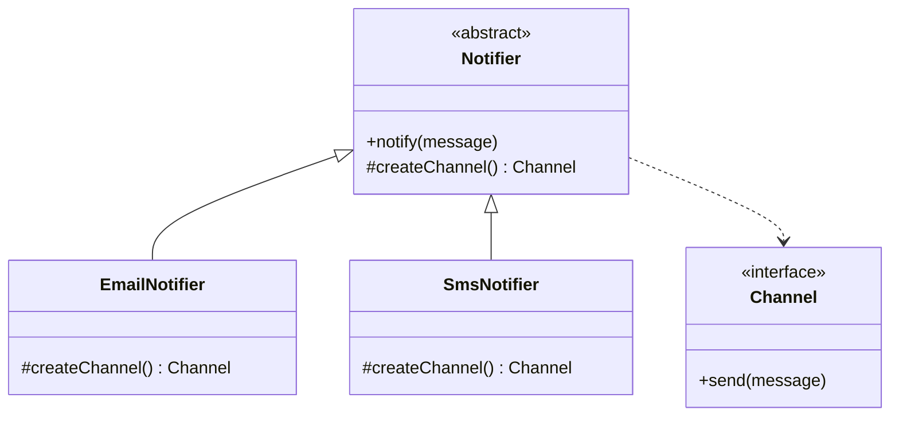

# GOF-FACTORY-METHOD - Factory Method Pattern

**Layer:** 2 (contextual)
**Categories:** software-design, design-patterns, object-oriented
**Applies-to:** all
**Summary:** Define a factory method in the creator so subclasses decide which concrete class to instantiate.

## Principle

Define an interface for creating an object, but let subclasses decide which class to instantiate. Factory Method defers instantiation to subclasses so that a class can delegate the responsibility of object creation without knowing the exact concrete type in advance. Use it when a class cannot anticipate the class of objects it must create, or when a class wants its subclasses to specify the objects it creates.

## Why it matters

Without Factory Method, a class that needs to create objects must hard-code the concrete class name, coupling itself directly to that implementation. Every new product type forces a change in the creator class. Factory Method eliminates this coupling, letting new product types be introduced by adding subclasses rather than modifying existing code.

## Violations to detect

- A class that uses `new ConcreteProduct()` directly when the product type should vary by context
- Conditional creation logic (switch on type codes) embedded in the class that uses the product
- Parallel class hierarchies where one hierarchy's classes always instantiate counterparts from the other by name

## Good practice



```java
// Violation - creator hard-codes the product
class Notifier {
    void notify(String msg) {
        EmailChannel ch = new EmailChannel();  // coupled to EmailChannel
        ch.send(msg);
    }
}

// Correct - factory method defers instantiation to subclass
abstract class Notifier {
    void notify(String msg) { createChannel().send(msg); }
    protected abstract Channel createChannel();
}
class EmailNotifier extends Notifier {
    protected Channel createChannel() { return new EmailChannel(); }
}
```

- Declare the factory method in the creator class as abstract or with a default implementation
- Each concrete creator subclass overrides the factory method to return the appropriate product
- Client code works with the creator and product through their abstract interfaces only
- Consider parameterized factory methods when the number of product variants is small and unlikely to grow

## Sources

- Gamma, Erich; Helm, Richard; Johnson, Ralph; Vlissides, John. *Design Patterns: Elements of Reusable Object-Oriented Software*. Addison-Wesley, 1994. ISBN 978-0-201-63361-0. Chapter 3, Creational Patterns.
