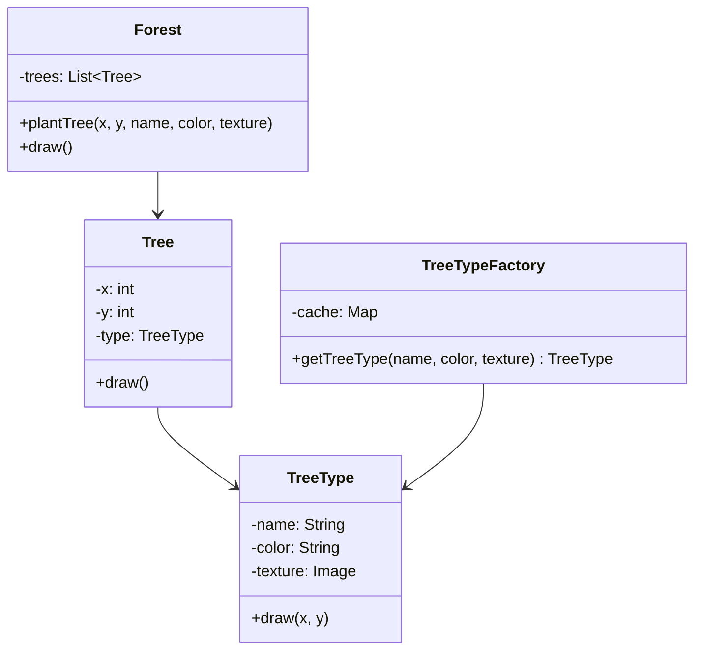

# GOF-FLYWEIGHT - Flyweight Pattern

**Layer:** 2 (contextual)
**Categories:** software-design, design-patterns, object-oriented
**Applies-to:** all
**Summary:** Share intrinsic, immutable state across many fine-grained objects to eliminate memory-wasting duplication.

## Principle

Use sharing to support large numbers of fine-grained objects efficiently. Flyweight separates intrinsic state (shared and context-independent) from extrinsic state (context-dependent, supplied by the client) so that many objects can reuse the same intrinsic data. Use Flyweight when an application creates a very large number of similar objects and memory cost is a concern.

## Why it matters

Without Flyweight, applications that create thousands or millions of similar objects consume excessive memory and may become impractical to run. Duplicating identical state across every instance wastes resources and can push systems past their memory limits, especially in domains like text rendering, game maps, or particle systems.

## Violations to detect

- Large collections of objects where most instance data is identical or could be shared
- High memory consumption caused by duplicated immutable state across many objects
- Performance problems stemming from excessive object allocation for conceptually similar items

## Good practice



```java
// Violation - each tree stores its own texture (megabytes duplicated)
class Tree { String name; String color; Image texture; int x; int y; }

// Correct - shared flyweight holds intrinsic state; tree holds only extrinsic (x, y)
TreeType type = TreeTypeFactory.getTreeType("Oak", "green", oakTexture);
Tree tree = new Tree(x, y, type);
```

- Identify and factor out intrinsic state into shared Flyweight objects managed by a Flyweight factory
- Pass extrinsic state to Flyweight methods as parameters rather than storing it in the shared object
- Use a factory or pool to ensure Flyweight instances are reused rather than duplicated
- Make Flyweight objects immutable to guarantee safe sharing across contexts

## Sources

- Gamma, Erich; Helm, Richard; Johnson, Ralph; Vlissides, John. *Design Patterns: Elements of Reusable Object-Oriented Software*. Addison-Wesley, 1994. ISBN 978-0-201-63361-0. Chapter 4, Structural Patterns - Flyweight.
