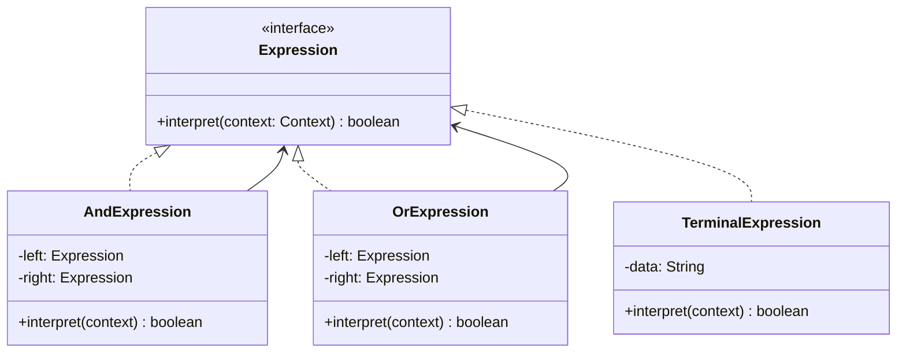

# GOF-INTERPRETER — Interpreter Pattern

**Layer:** 2 (contextual)
**Categories:** software-design, design-patterns, object-oriented
**Applies-to:** all
**Summary:** Map each grammar rule to a class and traverse the resulting tree to interpret domain-language expressions.

## Principle

Given a language, define a representation for its grammar along with an interpreter that uses the representation to interpret sentences in the language. Use Interpreter when you have a simple language to interpret, when efficiency is not critical, and when you can represent statements in the language as abstract syntax trees. Each grammar rule becomes a class; interpreting a sentence means traversing the tree of grammar objects.

## Why it matters

Without Interpreter, processing domain-specific expressions, rules, or queries typically requires hand-coded conditional logic scattered across the codebase. Interpreter makes each grammatical element explicit and extensible — adding a new expression type means adding a new class, not modifying existing parsing or evaluation logic.

## Violations to detect

- Hard-coded evaluation of domain expressions (search filters, business rules, configuration queries) spread across multiple methods
- A parser that builds intermediate data structures and then immediately switches on type codes to evaluate them — a sign that an object hierarchy would be cleaner
- New expression variants requiring changes to a central evaluator or switch statement

## Good practice



```java
// Build and evaluate a simple rule: "John AND (Julie OR Robert)"
Expression isMale = new TerminalExpression("John");
Expression isFemale = new OrExpression(
    new TerminalExpression("Julie"),
    new TerminalExpression("Robert"));
Expression rule = new AndExpression(isMale, isFemale);

System.out.println(rule.interpret(new Context("John")));   // false
System.out.println(rule.interpret(new Context("Julie")));  // false
```

- Define an `Expression` interface with an `interpret(context)` method
- Map each grammar rule to a concrete class (terminal or non-terminal expression)
- Build the abstract syntax tree from grammar objects and call `interpret` to evaluate
- Prefer Interpreter for simple grammars; use a parser generator (ANTLR, PEG) for complex or performance-sensitive languages

## Sources

- Gamma, Erich; Helm, Richard; Johnson, Ralph; Vlissides, John. *Design Patterns: Elements of Reusable Object-Oriented Software*. Addison-Wesley, 1994. ISBN 978-0-201-63361-0. Chapter 5, Behavioral Patterns — Interpreter.
