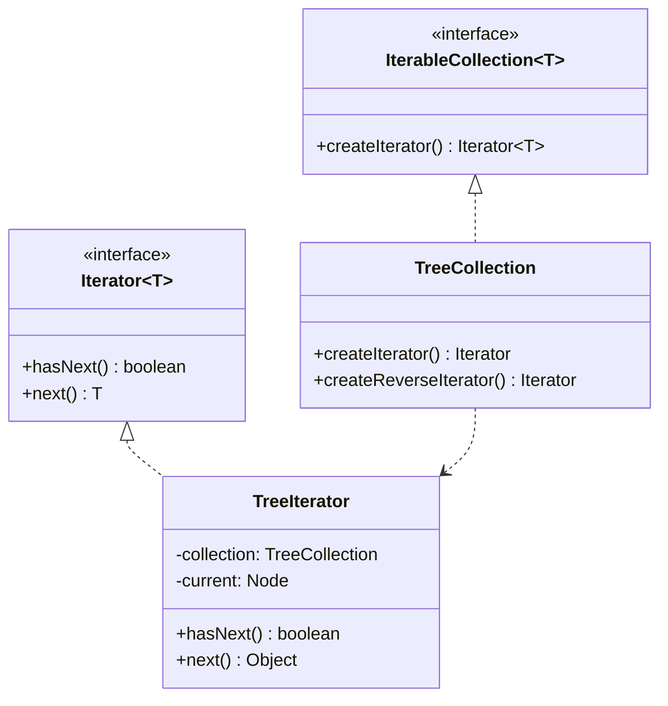

# GOF-ITERATOR — Iterator Pattern

**Layer:** 2 (contextual)
**Categories:** software-design, design-patterns, object-oriented
**Applies-to:** all
**Summary:** Traverse collections through an iterator object; never expose the collection's internal structure to callers.

## Principle

Provide a way to access the elements of an aggregate object sequentially without exposing its underlying representation. Extract traversal logic into a separate iterator object, allowing different traversal strategies over the same collection. Use Iterator when you need to traverse a collection without depending on its internal structure, or when you need to support multiple simultaneous or different-order traversals.

## Why it matters

Without Iterator, clients must know the internal structure of a collection to traverse it, creating tight coupling between traversal logic and data representation. Changing the collection's implementation forces changes in every piece of code that iterates over it, and supporting multiple traversal strategies becomes impractical.

## Violations to detect

- Client code that accesses collection internals (indices, node pointers, internal arrays) to iterate
- Traversal logic duplicated across multiple clients of the same collection
- Collections that cannot support multiple concurrent traversals because traversal state is stored in the collection itself
- Inability to change a collection's underlying data structure without breaking iteration code

## Good practice



```java
// Violation — client knows the tree's internal node structure
Node current = tree.getRoot();
while (current != null) { process(current); current = current.nextInOrder(); }

// Correct — iterate without knowing the tree's internals
Iterator<String> it = tree.createIterator();
while (it.hasNext()) { process(it.next()); }
```

- Define an Iterator interface with methods to access the current element and advance to the next
- Let each collection provide a factory method that creates an appropriate iterator for its structure
- Support multiple independent iterators over the same collection simultaneously
- Consider providing iterators for different traversal orders (e.g., depth-first, breadth-first, filtered)

## Sources

- Gamma, Erich; Helm, Richard; Johnson, Ralph; Vlissides, John. *Design Patterns: Elements of Reusable Object-Oriented Software*. Addison-Wesley, 1994. ISBN 978-0-201-63361-0. Chapter 5, Behavioral Patterns — Iterator.
