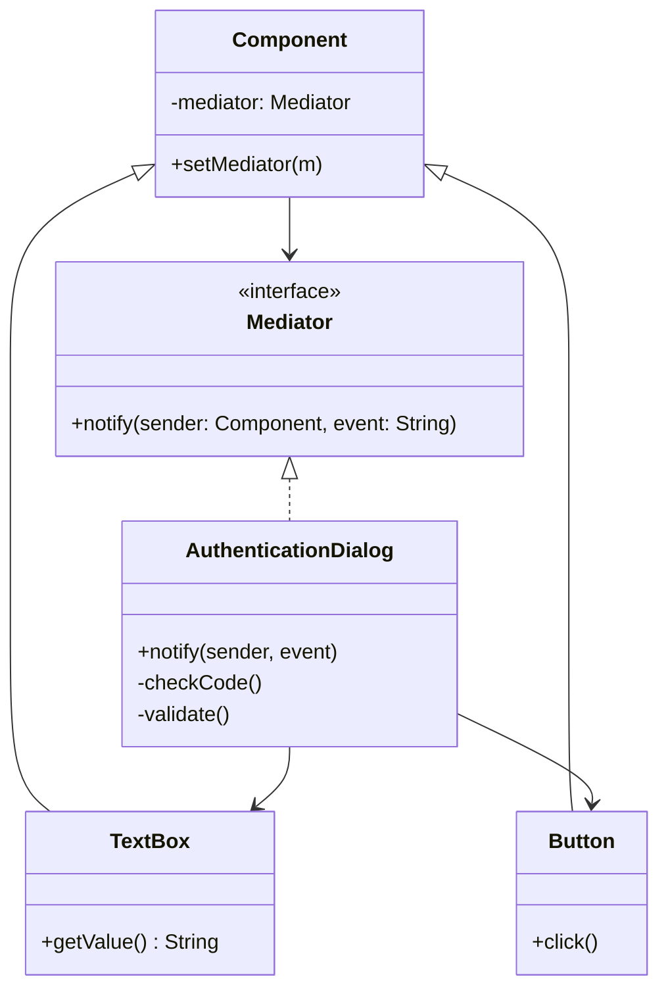

# GOF-MEDIATOR - Mediator Pattern

**Layer:** 2 (contextual)
**Categories:** software-design, design-patterns, object-oriented
**Applies-to:** all
**Summary:** Route all inter-component communication through a mediator; components must never reference each other directly.

## Principle

Define an object that encapsulates how a set of objects interact. Mediator promotes loose coupling by keeping objects from referring to each other explicitly and lets you vary their interaction independently. Use Mediator when a set of objects communicate in well-defined but complex ways that result in interdependencies that are difficult to understand or maintain.

## Why it matters

Without Mediator, objects that must coordinate with one another develop direct many-to-many references, creating a tightly coupled network that is hard to understand, change, or reuse. Adding a new participant or modifying an interaction requires changes across multiple classes, and individual objects become difficult to reuse in isolation.

## Violations to detect

- Multiple objects holding direct references to many peers and calling methods on each other to coordinate
- Changes to one component's behavior requiring updates in several other components
- Interaction logic scattered across participant classes rather than centralized
- Difficulty reusing a component in a different context because it depends on specific collaborators

## Good practice



```java
// Violation - components call each other directly
loginButton.onClick(() -> {
    if (!loginField.isEmpty() && !passwordField.isEmpty()) {
        okButton.enable();
    }
});

// Correct - components notify the mediator; mediator decides what to do
loginButton.onClick(() -> mediator.notify(loginButton, "click"));
```

- Introduce a mediator object that all participants communicate through instead of directly with each other
- Have each participant (colleague) know only the mediator, not the other participants
- Centralize complex coordination protocols in the mediator to make them easier to understand and modify
- Keep individual colleague classes simple and focused on their own behavior, delegating coordination to the mediator

## Sources

- Gamma, Erich; Helm, Richard; Johnson, Ralph; Vlissides, John. *Design Patterns: Elements of Reusable Object-Oriented Software*. Addison-Wesley, 1994. ISBN 978-0-201-63361-0. Chapter 5, Behavioral Patterns - Mediator.
