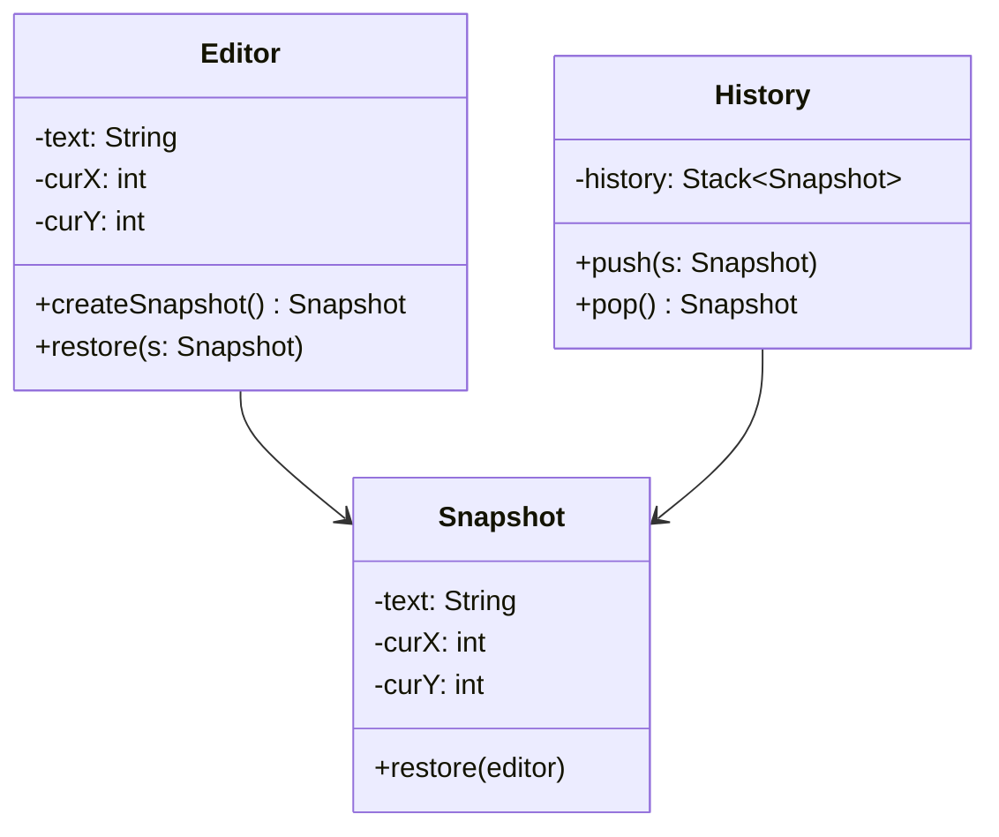

# GOF-MEMENTO — Memento Pattern

**Layer:** 2 (contextual)
**Categories:** software-design, design-patterns, object-oriented
**Applies-to:** all
**Summary:** Capture and restore object state through an opaque memento; never expose internal fields for undo or rollback.

## Principle

Capture and externalize an object's internal state without violating encapsulation, so that the object can be restored to this state later. The originator creates a memento containing a snapshot of its current state, and a caretaker holds the memento without examining or operating on its contents. Use Memento when you need to implement undo, checkpoints, or rollback mechanisms while preserving encapsulation.

## Why it matters

Without Memento, implementing undo or state restoration requires exposing an object's internal details to external code, violating encapsulation. This makes the originator's internals fragile and tightly coupled to the undo mechanism, and makes it difficult to change the object's representation without breaking the state-saving infrastructure.

## Violations to detect

- Undo or rollback logic that depends on direct access to an object's private fields
- State snapshots stored using public getters and setters that expose internal representation
- No clear separation between who creates state snapshots and who stores them
- Encapsulation violations introduced solely to support state saving and restoration

## Good practice



```java
// Violation — caretaker accesses editor internals to save state
String savedText = editor.text;  // breaks encapsulation
int savedX = editor.curX;

// Correct — originator creates an opaque snapshot; caretaker just stores it
Snapshot snap = editor.createSnapshot();
history.push(snap);
// Later:
editor.restore(history.pop());
```

- Let only the originator create and restore from mementos, keeping internal state encapsulated
- Make the memento opaque to the caretaker — it stores mementos but never inspects or modifies their contents
- Use a narrow interface for the caretaker (store and retrieve) and a wide interface accessible only to the originator
- Store only the state delta when full snapshots are too expensive

## Sources

- Gamma, Erich; Helm, Richard; Johnson, Ralph; Vlissides, John. *Design Patterns: Elements of Reusable Object-Oriented Software*. Addison-Wesley, 1994. ISBN 978-0-201-63361-0. Chapter 5, Behavioral Patterns — Memento.
