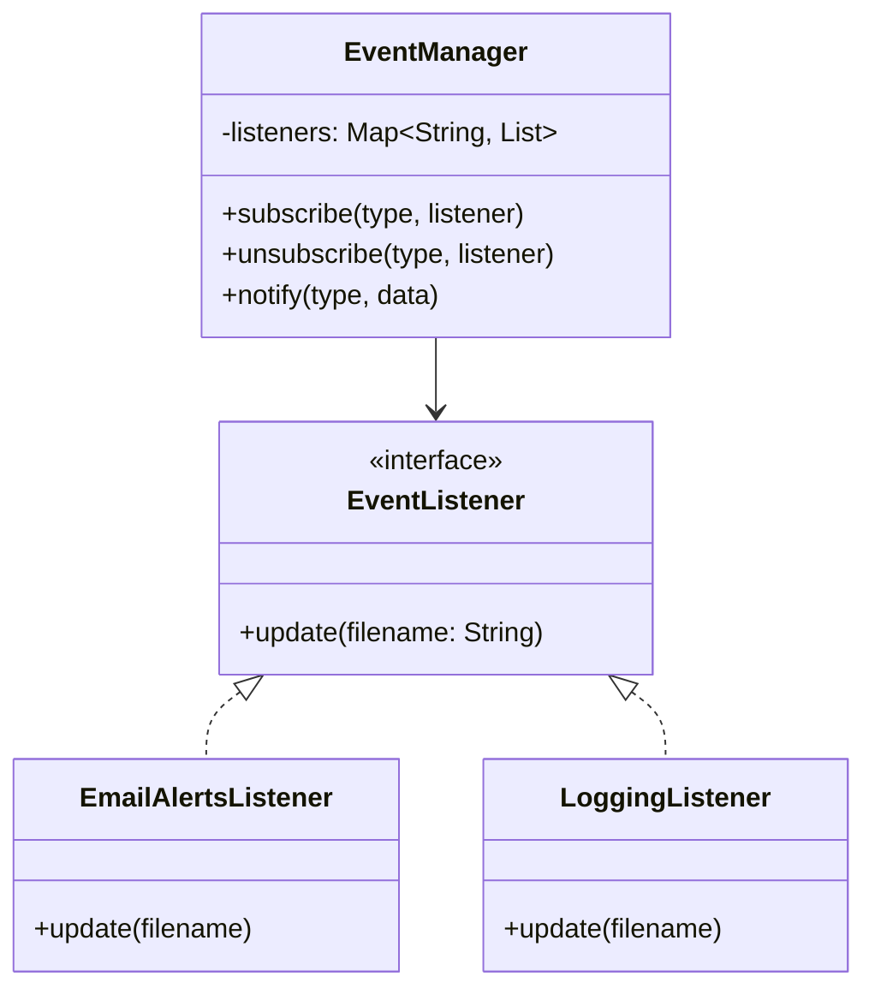

# GOF-OBSERVER — Observer Pattern

**Layer:** 2 (contextual)
**Categories:** software-design, design-patterns, object-oriented
**Applies-to:** all
**Summary:** Notify observers automatically via subscription; never hard-code dependents inside the subject.

## Principle

Define a one-to-many dependency between objects so that when one object (the subject) changes state, all its dependents (observers) are notified and updated automatically. It decouples the subject from the concrete observers that depend on it. Use Observer when a change to one object requires changing an unknown or dynamic set of other objects, or when an object should notify others without making assumptions about who those others are.

## Why it matters

Without Observer, objects that need to stay consistent with one another must be tightly coupled, with the source of change explicitly calling each dependent. This makes it impossible to add new dependents without modifying the subject, creates rigid relationships, and causes inconsistencies when updates are missed.

## Violations to detect

- A class that explicitly calls update methods on a hard-coded list of dependent classes when its state changes
- Inconsistent state across related objects because there is no reliable notification mechanism
- Inability to add new listeners or views without modifying the class that produces state changes
- Polling for state changes instead of being notified when changes occur

## Good practice



```java
// Violation — subject hard-codes its observers
class Editor {
    void save() {
        emailService.sendAlert(file);  // coupled to concrete observers
        logger.log(file);
    }
}

// Correct — observers register themselves; subject just notifies
editor.events.subscribe("open", logger);
editor.events.subscribe("save", emailAlerts);
editor.save();  // notifies all registered listeners generically
```

- Define a subject interface with methods to attach, detach, and notify observers
- Define an observer interface with an update method that the subject calls on state changes
- Let observers register and unregister dynamically at runtime
- Consider using a pull model (observers query the subject for details) or push model (subject sends change data) based on the specifics of the use case
- Manage observer lifecycle carefully to avoid dangling references and memory leaks

## Sources

- Gamma, Erich; Helm, Richard; Johnson, Ralph; Vlissides, John. *Design Patterns: Elements of Reusable Object-Oriented Software*. Addison-Wesley, 1994. ISBN 978-0-201-63361-0. Chapter 5, Behavioral Patterns — Observer.
