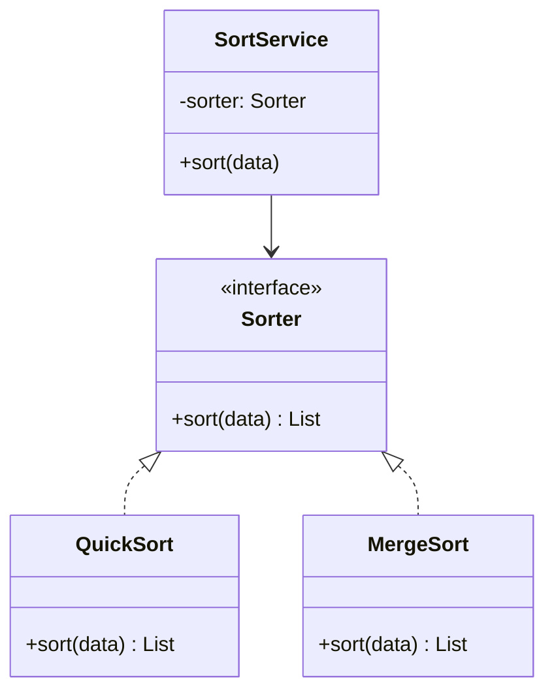

# GOF-PROGRAM-TO-INTERFACE - Program to an Interface, Not an Implementation

**Layer:** 2 (contextual)
**Categories:** software-design, design-patterns, object-oriented
**Applies-to:** all
**Summary:** Declare all variables and parameters against abstract interfaces, never against concrete implementation types.

## Principle

Declare variables, parameters, and return types using abstract interfaces rather than concrete classes. Clients should depend only on the abstract contract a collaborator fulfills, never on the specific class that implements it. This decouples the code that uses an object from the code that creates it, allowing implementations to be substituted without modifying the caller.

## Why it matters

When code depends on concrete types, every new implementation forces changes in the consumers. This makes the system rigid and difficult to test, because swapping in a mock, stub, or alternative implementation requires rewriting call sites. Programming to an interface confines the impact of change to the implementation side and keeps the rest of the system stable.

## Violations to detect

- Variables or parameters typed to a concrete class when an abstract type or interface exists
- Client code that calls methods specific to a concrete subclass rather than the declared interface
- Direct instantiation of collaborators inside business logic instead of receiving them through injection
- Conditional logic that checks the concrete type of an object to decide behavior (instanceof/type-checking chains)

## Good practice

Program to the `Sorter` interface, not to `QuickSort`.



```java
// Violation - typed to a concrete class
QuickSort sorter = new QuickSort();
sorter.sort(data);

// Correct - typed to the interface; implementation injected
Sorter sorter = new QuickSort();  // or MergeSort, or a test double
sorter.sort(data);
```

- Define abstract interfaces or base types for every major role in the system
- Use factory methods or dependency injection to create concrete instances, keeping creation separate from use
- Ensure subtypes honor the contract of the interface they implement (Liskov substitutability)
- Write tests against the interface so that any conforming implementation can be verified with the same suite

## Sources

- Gamma, Erich; Helm, Richard; Johnson, Ralph; Vlissides, John. *Design Patterns: Elements of Reusable Object-Oriented Software*. Addison-Wesley, 1994. ISBN 978-0-201-63361-0. Chapter 1, Introduction.
