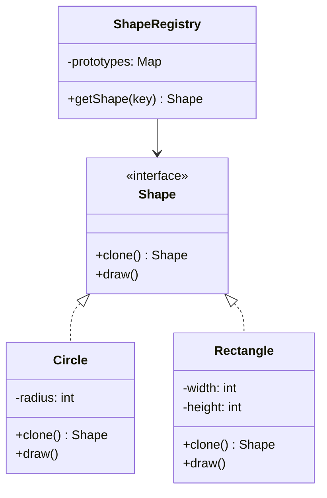

# GOF-PROTOTYPE — Prototype Pattern

**Layer:** 2 (contextual)
**Categories:** software-design, design-patterns, object-oriented
**Applies-to:** all
**Summary:** Create new objects by cloning a pre-configured prototype rather than constructing them from scratch.

## Principle

Specify the kinds of objects to create using a prototypical instance, and create new objects by copying this prototype. Use Prototype when a system should be independent of how its products are created, composed, and represented, and when the classes to instantiate are specified at runtime. The pattern is particularly useful when creating an object from scratch is expensive but copying an existing, properly configured instance is cheap.

## Why it matters

Without Prototype, adding new types of objects to a system often requires new classes or factory modifications. When object initialization is costly (complex state, database loads, deep hierarchies), repeatedly constructing from scratch wastes resources and duplicates setup logic. Prototype avoids these problems by cloning a ready-made instance.

## Violations to detect

- Complex object initialization logic duplicated in multiple places that could instead clone a pre-configured template
- A growing set of factory subclasses whose only difference is which product they instantiate
- Systems that configure objects at runtime but have no mechanism to replicate a configured instance

## Good practice



```java
// Correct — clone a pre-configured prototype instead of rebuilding
ShapeRegistry registry = new ShapeRegistry();
registry.register("circle", new Circle(10));

Shape s = registry.getShape("circle").clone();  // cheap copy, no re-init
```

- Implement a `clone` method on the prototype interface that performs a deep copy of the object's state
- Maintain a registry of prototypes that can be looked up by key and cloned on demand
- Be explicit about deep versus shallow copy semantics to avoid shared-state bugs
- Use Prototype when the number of object configurations is large or determined at runtime, making a class-per-variant approach impractical

## Sources

- Gamma, Erich; Helm, Richard; Johnson, Ralph; Vlissides, John. *Design Patterns: Elements of Reusable Object-Oriented Software*. Addison-Wesley, 1994. ISBN 978-0-201-63361-0. Chapter 3, Creational Patterns.
