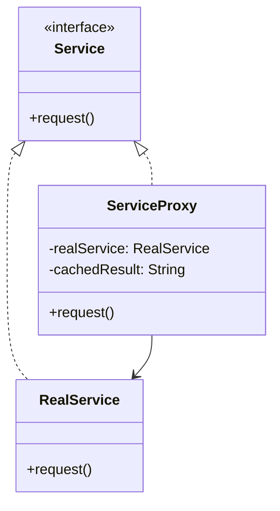

# GOF-PROXY — Proxy Pattern

**Layer:** 2 (contextual)
**Categories:** software-design, design-patterns, object-oriented
**Applies-to:** all
**Summary:** Use a same-interface surrogate to control, defer, or augment access to the real subject transparently.

## Principle

Provide a surrogate or placeholder for another object to control access to it. The proxy implements the same interface as the real subject, allowing it to be used transparently in its place. Common variants include remote proxies (representing objects in different address spaces), virtual proxies (creating expensive objects on demand), and protection proxies (controlling access based on permissions).

## Why it matters

Without Proxy, clients must handle concerns like lazy initialization, access control, logging, and remote communication directly, mixing infrastructure logic with business logic. This leads to duplicated cross-cutting code and makes it difficult to change how and when the real object is accessed.

## Violations to detect

- Expensive object creation performed eagerly when the object may never be used
- Access control checks scattered throughout client code rather than centralized
- Clients managing remote communication details instead of working through a local stand-in
- Repeated boilerplate for logging, caching, or reference counting around object access

## Good practice



```java
// Violation — eager, unguarded access to expensive resource
class Client {
    private DatabaseService db = new DatabaseService();  // slow init always
    void query() { db.execute(sql); }
}

// Correct — virtual proxy defers creation until actually needed
class DatabaseServiceProxy implements DatabaseService {
    private DatabaseService real;
    public ResultSet execute(String sql) {
        if (real == null) real = new RealDatabaseService();  // lazy init
        return real.execute(sql);
    }
}
```

- Give the proxy the same interface as the real subject so clients need not distinguish between them
- Use virtual proxies to defer costly creation until the object is actually needed
- Use protection proxies to enforce access rights in a single, consistent location
- Keep the proxy thin — delegate real work to the subject and limit the proxy to its cross-cutting concern

## Sources

- Gamma, Erich; Helm, Richard; Johnson, Ralph; Vlissides, John. *Design Patterns: Elements of Reusable Object-Oriented Software*. Addison-Wesley, 1994. ISBN 978-0-201-63361-0. Chapter 4, Structural Patterns — Proxy.
