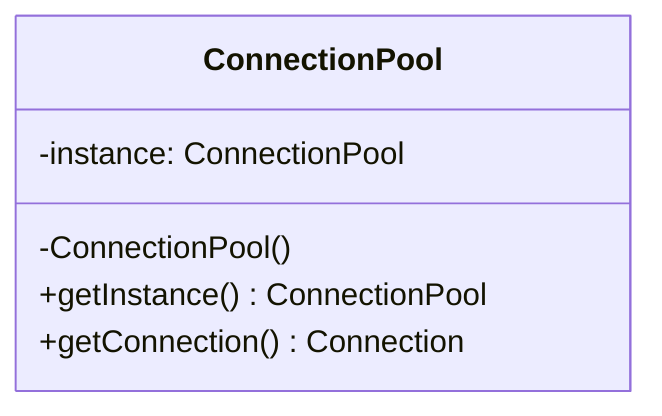

# GOF-SINGLETON - Singleton Pattern

**Layer:** 2 (contextual)
**Categories:** software-design, design-patterns, object-oriented
**Applies-to:** all
**Summary:** Prefer dependency injection of a shared instance over a global Singleton; avoid mutable global state.

## Principle

Ensure a class has only one instance and provide a global point of access to it. Use Singleton when there must be exactly one instance of a class (e.g., a single connection pool, configuration registry, or logging facility), and when that instance must be accessible from a well-known access point. Apply this pattern sparingly: in most situations, dependency injection of a shared instance is a better alternative that provides the same "single instance" semantics without the drawbacks listed below.

## Why it matters

Without a controlled mechanism for unique instantiation, code may accidentally create multiple instances of something that should be shared (database connection pools, hardware drivers), leading to resource leaks or inconsistent state. However, overusing Singleton introduces hidden global state, makes unit testing difficult because the instance cannot be easily replaced with a test double, and creates tight coupling between the Singleton and every class that references it.

**Modern consensus:** Singleton is widely considered an anti-pattern when used as a substitute for dependency injection. Prefer injecting a shared instance through a DI container, reserving Singleton for cases where a global point of access is genuinely required.

## Violations to detect

- Multiple singletons used as service locators, effectively hiding a dependency graph that should be explicit
- Singleton access scattered across the codebase making it impossible to test classes in isolation
- Mutable global state stored in a Singleton that creates unpredictable side effects between tests or threads
- Using Singleton purely for convenience when an injected shared instance would suffice
- Lazy initialization in multithreaded code without proper synchronization

## Good practice



```java
// Classic thread-safe Singleton (static holder idiom)
public class ConnectionPool {
    private ConnectionPool() {}
    private static class Holder {
        static final ConnectionPool INSTANCE = new ConnectionPool();
    }
    public static ConnectionPool getInstance() { return Holder.INSTANCE; }
}

// Preferred modern approach - inject as a shared instance via DI
// rather than calling ConnectionPool.getInstance() everywhere
@Bean
public ConnectionPool connectionPool() { return new ConnectionPool(); }
```

- Prefer dependency injection of a shared instance over direct Singleton access; reserve the pattern for cases where a single point of access is genuinely required by the domain
- If you do use Singleton, provide a way to reset or replace the instance in tests (e.g., an internal setter or scope-based override)
- Ensure thread-safe initialization (static holder idiom, `std::call_once`, synchronized block, or language-level guarantees)
- Keep the Singleton's responsibilities narrow; it should manage its own uniqueness, not accumulate unrelated logic

## Sources

- Gamma, Erich; Helm, Richard; Johnson, Ralph; Vlissides, John. *Design Patterns: Elements of Reusable Object-Oriented Software*. Addison-Wesley, 1994. ISBN 978-0-201-63361-0. Chapter 3, Creational Patterns.
- Martin, Robert C. "Clean Code." Presented at NDC conferences. Notes on Singleton as anti-pattern.
