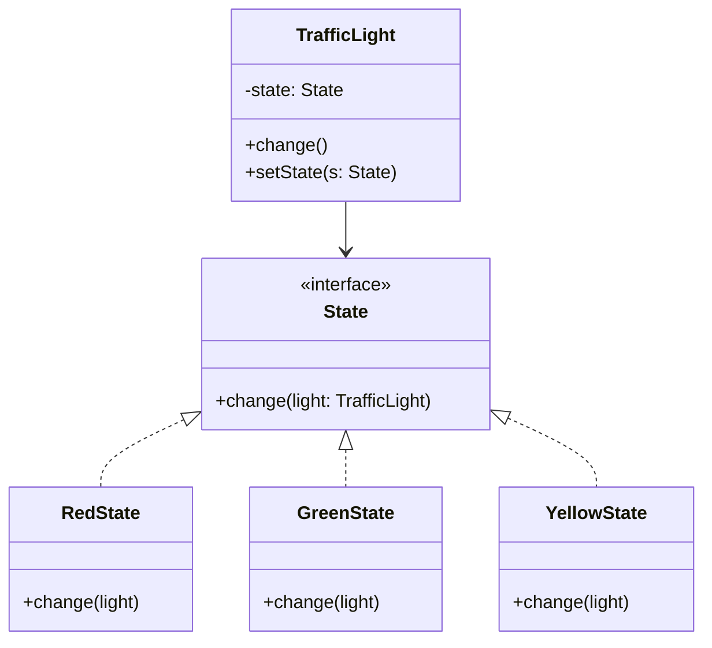

# GOF-STATE — State Pattern

**Layer:** 2 (contextual)
**Categories:** software-design, design-patterns, object-oriented
**Applies-to:** all
**Summary:** Encapsulate state-specific behavior in separate state objects and delegate to the current state at runtime.

## Principle

Allow an object to alter its behavior when its internal state changes, making the object appear to change its class. Encapsulate state-specific behavior into separate state objects and delegate state-dependent requests to the current state object. Use State when an object's behavior depends on its state and it must change behavior at runtime depending on that state, especially when operations contain large conditional statements that depend on the object's state.

## Why it matters

Without State, state-dependent behavior is implemented through large conditional blocks that grow with every new state, becoming difficult to read, maintain, and extend. Adding a new state requires modifying every operation that has state-dependent behavior, spreading related logic across multiple methods and increasing the risk of errors.

## Violations to detect

- Methods dominated by switch or if-else statements that check the object's current state
- State-dependent behavior scattered across multiple methods with duplicated state checks
- Adding a new state requires modifying many existing methods throughout the class
- State transitions managed through flag variables with complex conditional logic

## Good practice



```java
// Violation — monolithic switch on state field
void change() {
    switch (state) {
        case RED: state = GREEN; break;
        case GREEN: state = YELLOW; break;
        case YELLOW: state = RED; break;
    }
}

// Correct — each state handles its own transition
class RedState implements State {
    public void change(TrafficLight light) {
        light.setState(new GreenState());
    }
}
```

- Create a State interface with methods for each state-dependent operation
- Implement each state as a concrete class that encapsulates the behavior for that state
- Delegate state-dependent requests from the context to the current state object
- Define state transitions in the state objects themselves or in the context, keeping the transition logic explicit and localized
- Make state objects singletons or flyweights when they carry no instance-specific data

## Sources

- Gamma, Erich; Helm, Richard; Johnson, Ralph; Vlissides, John. *Design Patterns: Elements of Reusable Object-Oriented Software*. Addison-Wesley, 1994. ISBN 978-0-201-63361-0. Chapter 5, Behavioral Patterns — State.
