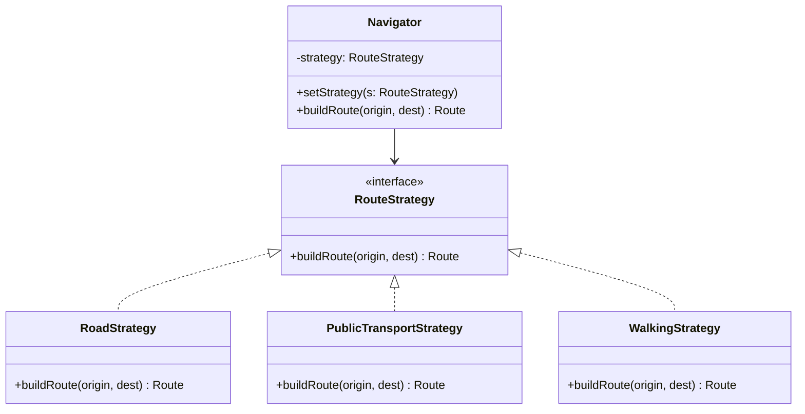

# GOF-STRATEGY — Strategy Pattern

**Layer:** 2 (contextual)
**Categories:** software-design, design-patterns, object-oriented
**Applies-to:** all
**Summary:** Encapsulate each algorithm variant behind a common interface and inject the chosen strategy at runtime.

## Principle

Define a family of algorithms, encapsulate each one, and make them interchangeable. Strategy lets the algorithm vary independently from the clients that use it. Use Strategy when you need different variants of an algorithm, when an algorithm uses data that clients should not know about, or when a class defines many behaviors that appear as multiple conditional statements in its operations.

## Why it matters

Without Strategy, algorithm variants are embedded directly in the class that uses them, typically as conditional branches. This makes the class harder to understand and maintain, prevents reuse of individual algorithms, and requires modifying the class every time a new algorithm is added or an existing one changes.

## Violations to detect

- Conditional statements selecting among algorithm variants within a single class
- Duplicated algorithm logic across multiple classes that differ only in one behavioral aspect
- Inability to add new algorithmic behavior without modifying the context class
- Algorithm implementation details exposed to the client when they should be encapsulated

## Good practice



```java
// Violation — routing algorithm embedded in Navigator with conditionals
Route buildRoute(String origin, String dest, String mode) {
    if ("car".equals(mode)) { /* road algorithm */ }
    else if ("bus".equals(mode)) { /* transit algorithm */ }
    else { /* walking algorithm */ }
}

// Correct — inject the strategy; Navigator delegates to it
navigator.setStrategy(new PublicTransportStrategy());
Route route = navigator.buildRoute("A", "B");
```

- Define a Strategy interface that all algorithm variants implement
- Let the context hold a reference to a Strategy and delegate algorithmic work to it
- Allow strategies to be swapped at runtime through setter injection or constructor injection
- Factor shared algorithm logic into a base class if strategies share common steps
- Prefer Strategy over subclassing the context when the variation is limited to a single aspect of behavior

## Sources

- Gamma, Erich; Helm, Richard; Johnson, Ralph; Vlissides, John. *Design Patterns: Elements of Reusable Object-Oriented Software*. Addison-Wesley, 1994. ISBN 978-0-201-63361-0. Chapter 5, Behavioral Patterns — Strategy.
