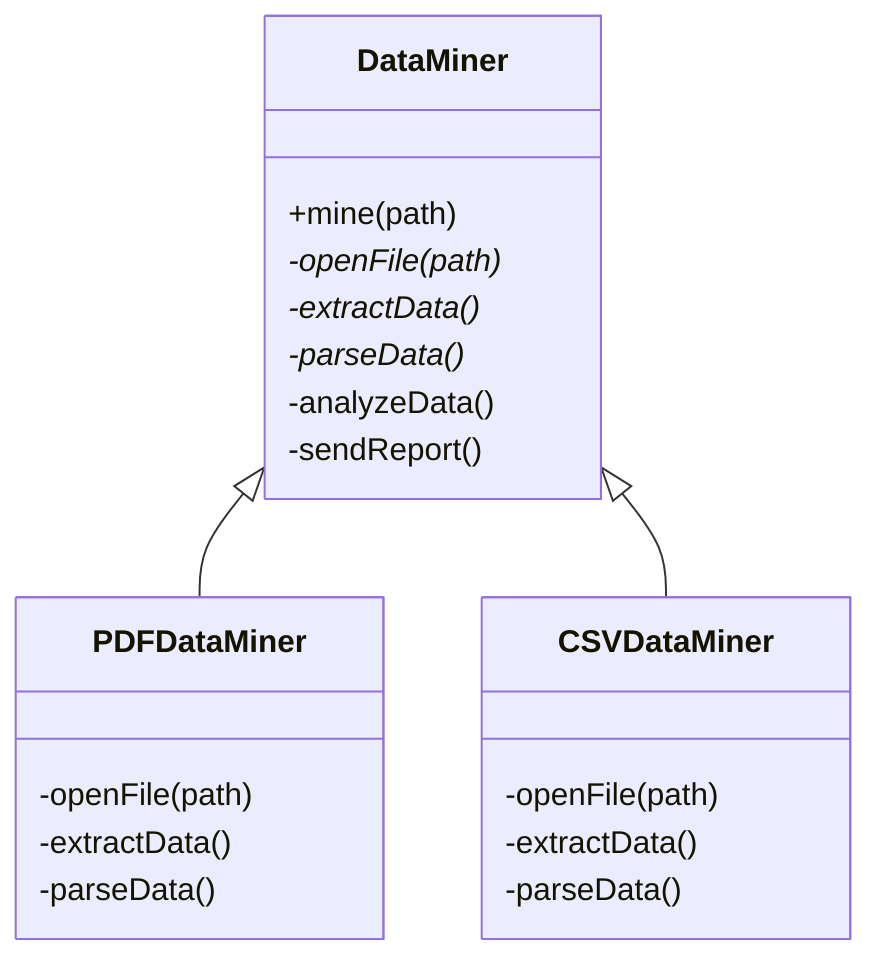

# GOF-TEMPLATE-METHOD - Template Method Pattern

**Layer:** 2 (contextual)
**Categories:** software-design, design-patterns, object-oriented
**Applies-to:** all
**Summary:** Define the algorithm skeleton in a final base-class method; let subclasses override only the varying steps.

## Principle

Define the skeleton of an algorithm in a method, deferring some steps to subclasses. Template Method lets subclasses redefine certain steps of an algorithm without changing the algorithm's structure. Use Template Method when you have an invariant algorithm structure with steps that vary across implementations, and when you want to centralize common behavior in a single place to avoid code duplication among subclasses.

## Why it matters

Without Template Method, subclasses that share a common algorithmic structure end up duplicating the skeleton code, leading to inconsistencies and maintenance burdens. Changes to the overall algorithm must be replicated across every subclass, and there is no enforcement that subclasses follow the intended sequence of steps.

## Violations to detect

- Multiple subclasses implementing the same overall algorithm with copy-pasted structure and minor variations
- No central control over the order of algorithmic steps, allowing subclasses to accidentally skip or reorder them
- Hook points that should be optional overrides but are instead required, forcing subclasses to provide empty implementations
- Algorithmic structure duplicated across a class hierarchy with only individual steps differing

## Good practice



```java
// Violation - skeleton duplicated in every subclass
class PDFMiner {
    void mine() { openPDF(); extractPDF(); parsePDF(); analyze(); report(); }
}
class CSVMiner {
    void mine() { openCSV(); extractCSV(); parseCSV(); analyze(); report(); }
}

// Correct - skeleton in base class; only format-specific steps overridden
abstract class DataMiner {
    final void mine(String path) {  // template method - final to prevent override
        openFile(path); extractData(); parseData(); analyzeData(); sendReport();
    }
    protected abstract void openFile(String path);
    protected abstract void extractData();
    protected abstract void parseData();
    protected void analyzeData() { /* default analysis */ }
    protected void sendReport() { /* default report */ }
}
```

- Define the template method in the base class as a final or non-overridable method to lock down the algorithm structure
- Mark primitive operations (required steps) as abstract methods that subclasses must implement
- Provide hook methods with default (often empty) implementations for optional extension points
- Minimize the number of primitive operations a subclass must override to keep subclassing manageable
- Apply the Hollywood Principle: the base class calls subclass methods, not the other way around

## Sources

- Gamma, Erich; Helm, Richard; Johnson, Ralph; Vlissides, John. *Design Patterns: Elements of Reusable Object-Oriented Software*. Addison-Wesley, 1994. ISBN 978-0-201-63361-0. Chapter 5, Behavioral Patterns - Template Method.
