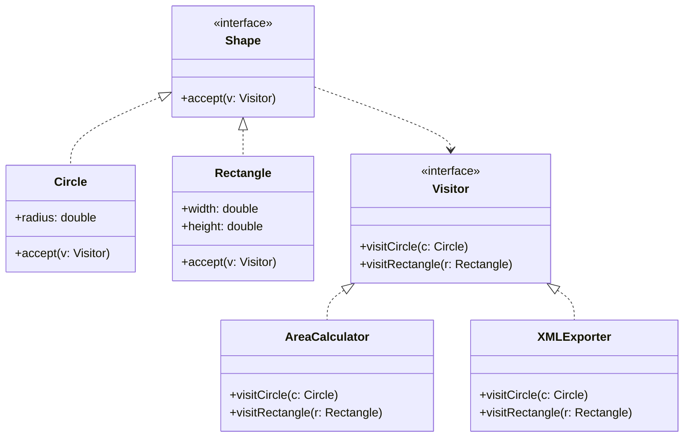

# GOF-VISITOR — Visitor Pattern

**Layer:** 2 (contextual)
**Categories:** software-design, design-patterns, object-oriented
**Applies-to:** all
**Summary:** Add new operations to a stable object hierarchy via a new Visitor class; never modify the element classes.

## Principle

Represent an operation to be performed on elements of an object structure. Visitor lets you define a new operation without changing the classes of the elements on which it operates. Use Visitor when you need to perform many distinct and unrelated operations on an object structure without polluting those classes, and when the object structure is stable but new operations are frequently added.

## Why it matters

Without Visitor, adding a new operation to a class hierarchy requires modifying every class in the hierarchy. This violates the open-closed principle when operations change frequently. Visitor externalizes operations into visitor objects, so adding a new operation is a matter of adding a new visitor class without touching the element classes.

## Violations to detect

- Element classes cluttered with many unrelated operations that could be externalized
- Adding a new operation to a stable class hierarchy requires modifying multiple classes
- Repeated `instanceof` checks followed by casts to perform type-specific operations on elements of a hierarchy
- Operations that need to aggregate data across many element types, with logic scattered across each element class

## Good practice



```java
// Violation — each new operation requires modifying Circle and Rectangle
class Circle {
    double area() { return Math.PI * radius * radius; }
    String toXml() { return "<circle r='" + radius + "'/>"; }  // unrelated concerns
}

// Correct — element accepts a visitor; new operations = new visitor classes
class Circle implements Shape {
    public void accept(Visitor v) { v.visitCircle(this); }
}
class AreaCalculator implements Visitor {
    public void visitCircle(Circle c) { total += Math.PI * c.radius * c.radius; }
    public void visitRectangle(Rectangle r) { total += r.width * r.height; }
}
```

- Define a `Visitor` interface with a `visit` method for each concrete element type
- Each element class implements `accept(Visitor v)` and calls `v.visit(this)` (double dispatch)
- Add new operations by adding new Visitor implementations — no changes to element classes
- Use Visitor when the element hierarchy is stable and new operations are the common change; prefer other patterns if new element types are frequently added

## Sources

- Gamma, Erich; Helm, Richard; Johnson, Ralph; Vlissides, John. *Design Patterns: Elements of Reusable Object-Oriented Software*. Addison-Wesley, 1994. ISBN 978-0-201-63361-0. Chapter 5, Behavioral Patterns — Visitor.
