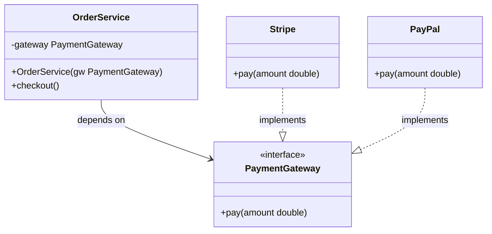

# SOLID-DIP — Dependency Inversion Principle

**Layer:** 1 (universal)
**Categories:** software-design, dependency-management, testability
**Applies-to:** all
**Summary:** High-level modules must depend on abstractions, never on concrete low-level implementations.

## Principle

High-level modules should not depend on low-level modules; both should depend on abstractions. Abstractions should not depend on details; details should depend on abstractions. Source code dependencies must point toward abstractions, not concrete implementations.

## Why it matters

When high-level policy directly instantiates or imports low-level detail (a specific database driver, a concrete HTTP client), the policy is coupled to that detail. Swapping the detail requires changing the policy. Testability suffers because tests cannot substitute a fake for the real dependency. Architectural layers collapse into a tangle.

## Violations to detect

- A service class that calls `new DatabaseConnection(...)` or `new HttpClient(...)` inside a method
- A high-level use-case class importing a concrete infrastructure class from a low-level package
- Dependency injection containers bypassed by direct instantiation inside business logic
- Unit tests that cannot run without a real database, network, or filesystem because dependencies are concrete

## Good practice

`OrderService` depends on the `PaymentGateway` abstraction — not on `Stripe` or `PayPal` directly. Either implementation can be injected at runtime or swapped in tests.



```java
// Violation — OrderService locked to Stripe; untestable
class OrderService {
    void checkout(Order o) {
        Stripe stripe = new Stripe(); // hard dependency on concrete class
        stripe.charge(o.total());
    }
}

// Correct — depend on the abstraction; inject the detail
interface PaymentGateway {
    void pay(double amount);
}
class Stripe implements PaymentGateway {
    public void pay(double amount) { /* Stripe API call */ }
}
class PayPal implements PaymentGateway {
    public void pay(double amount) { /* PayPal API call */ }
}

class OrderService {
    private final PaymentGateway gateway;

    OrderService(PaymentGateway gw) { this.gateway = gw; } // inject at construction

    void checkout(Order o) { gateway.pay(o.total()); }
}

// Inject Stripe or PayPal at runtime; inject a fake in tests
new OrderService(new Stripe());
new OrderService(new PayPal());
new OrderService(new FakePaymentGateway()); // test double
```

- Use a dependency injection container or factory at the composition root — not inside business logic
- Define interfaces in the high-level module's package; let the low-level module implement them (the "plugin" architecture)

## Sources

- Martin, Robert C. *Agile Software Development: Principles, Patterns, and Practices*. Pearson, 2003. ISBN 978-0-13-597444-5. Chapter 11.
- Martin, Robert C. *Clean Architecture*. Prentice Hall, 2017. ISBN 978-0-13-449416-6. Chapter 5.
