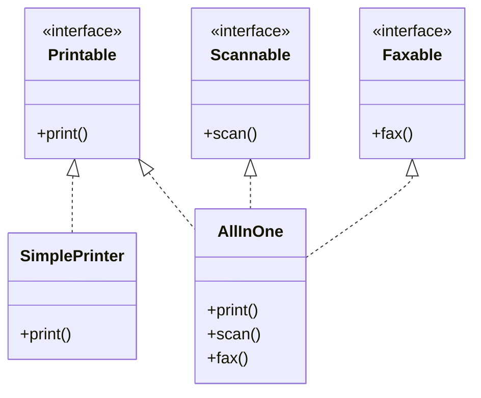

# SOLID-ISP - Interface Segregation Principle

**Layer:** 1 (universal)
**Categories:** software-design, api-design, coupling
**Applies-to:** all
**Summary:** Split fat interfaces into focused role interfaces so each client depends only on methods it actually uses.

## Principle

Clients should not be forced to depend on interfaces they do not use. Large, general-purpose interfaces should be split into smaller, focused ones so that each client depends only on the methods it actually calls.

## Why it matters

Fat interfaces create phantom coupling: a class that uses only one method of a ten-method interface is recompiled (and risks change) whenever any of the other nine methods change. This couples unrelated clients and forces implementors to stub or throw for methods they do not need.

## Violations to detect

- An interface with many methods where most implementors leave several as empty stubs or `throw UnsupportedOperationException`
- A class importing or implementing an interface only to use a single method
- A "manager" or "service" interface that combines read operations, write operations, and admin operations into one type
- Frequent recompilation or test failures in unrelated modules when an interface changes

## Good practice

Split a fat interface into focused role interfaces. `SimplePrinter` implements only `Printable`; `AllInOne` implements all three - neither is forced to stub anything.



```java
// Violation - SimplePrinter forced to implement methods it doesn't use
interface Machine {
    void print();
    void scan();
    void fax();
}
class SimplePrinter implements Machine {
    public void print() { ... }
    public void scan()  { throw new UnsupportedOperationException(); } // forced stub
    public void fax()   { throw new UnsupportedOperationException(); } // forced stub
}

// Correct - each interface is a focused role
interface Printable { void print(); }
interface Scannable { void scan(); }
interface Faxable   { void fax(); }

class SimplePrinter implements Printable {
    public void print() { ... }
}
class AllInOne implements Printable, Scannable, Faxable {
    public void print() { ... }
    public void scan()  { ... }
    public void fax()   { ... }
}
```

- Define role interfaces: each interface represents one role a client expects
- In dynamic languages, use duck typing or structural protocols for the same effect

## Sources

- Martin, Robert C. *Agile Software Development: Principles, Patterns, and Practices*. Pearson, 2003. ISBN 978-0-13-597444-5. Chapter 12.
- Martin, Robert C. "The Interface Segregation Principle." *C++ Report*, 1996. Reprinted in *Principles of OOD*, https://web.archive.org/web/20110714224545/http://www.objectmentor.com/resources/articles/isp.pdf
