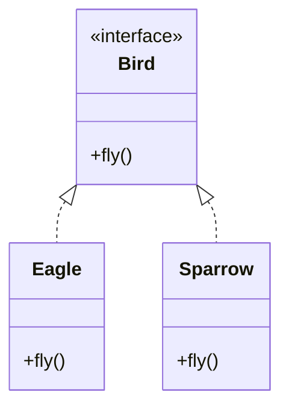

# SOLID-LSP - Liskov Substitution Principle

**Layer:** 1 (universal)
**Categories:** software-design, correctness, inheritance
**Applies-to:** all
**Summary:** Subtypes must be fully substitutable for their base type without requiring special-case logic in callers.

## Principle

Subtypes must be substitutable for their base types without altering the correctness of the program. Any code that uses a reference to a base class must work correctly with any subclass instance, without needing to know the concrete type.

## Why it matters

Violations break the contract that polymorphism depends on. Callers are forced to add type checks, switch statements, or special-case logic for subtypes, negating the benefit of inheritance and introducing fragility whenever a new subtype is added.

## Violations to detect

- A subclass that throws `UnsupportedOperationException` (or equivalent) for methods inherited from the base class
- A subclass that strengthens preconditions (requires more from callers) or weakens postconditions (guarantees less)
- Code that casts to a subtype in order to call methods not on the base type
- `instanceof` checks followed by special-case logic for specific subtypes
- A `Square` extends `Rectangle` where setting width also sets height, violating the rectangle contract

## Good practice

Every subtype must honour the full contract of the base type. Both `Eagle` and `Sparrow` satisfy the `Bird` contract - `makeFly` works correctly with either, with no special-casing.



```java
// Violation - Penguin breaks the Bird contract
class Penguin extends Bird {
    @Override
    void fly() { throw new UnsupportedOperationException("Penguins can't fly"); }
}
void makeFly(Bird bird) {
    bird.fly(); // blows up for Penguin - LSP violated
}

// Correct - every Bird subtype honours fly()
interface Bird {
    void fly();
}
class Eagle implements Bird {
    public void fly() { /* soar */ }
}
class Sparrow implements Bird {
    public void fly() { /* flutter */ }
}

void makeFly(Bird bird) {
    bird.fly(); // works with any Bird
}
makeFly(new Eagle());   // OK
makeFly(new Sparrow()); // OK
```

- Prefer composition over inheritance when a subtype cannot honour the full base contract
- Write tests against the base type and run them against all subtypes (Liskov test suite pattern)
- Use the "is-substitutable-for" test, not just the "is-a" test, when modelling hierarchies

## Sources

- Liskov, Barbara, and Jeannette Wing. "A Behavioral Notion of Subtyping." *ACM Transactions on Programming Languages and Systems* 16, no. 6 (1994): 1811-1841. https://doi.org/10.1145/197320.197383
- Martin, Robert C. *Agile Software Development: Principles, Patterns, and Practices*. Pearson, 2003. ISBN 978-0-13-597444-5. Chapter 10.
