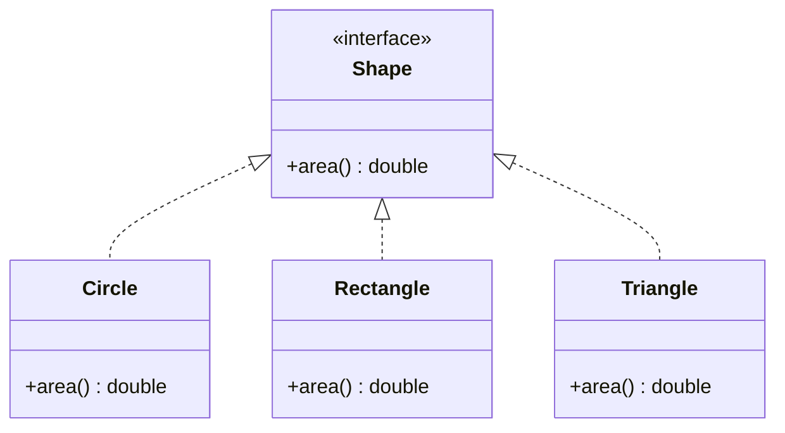

# SOLID-OCP - Open/Closed Principle

**Layer:** 1 (universal)
**Categories:** software-design, extensibility, maintainability
**Applies-to:** all
**Summary:** Add new behavior by writing new code that implements an abstraction; never modify existing proven code.

## Principle

Software entities - classes, modules, functions - should be open for extension but closed for modification. New behaviour should be addable by writing new code, not by changing existing, proven code.

## Why it matters

Every time existing code is modified to add new behaviour, previously working functionality is at risk of regression. Systems that require source changes to accommodate new requirements accumulate risk with each change and resist safe deployment.

## Violations to detect

- A long `if/else` or `switch` chain on a type discriminator that grows with every new type
- A function that is modified directly every time a new case is added instead of dispatching to a strategy
- Business logic mixed with variant-specific handling, making extension require editing a shared core
- Hard-coded conditionals on feature flags or entity types that should be polymorphic

## Good practice

Define an abstraction, then add new behaviour by implementing it - the `Shape` interface never changes as new shapes are added.



```java
// Violation - must modify existing code for every new shape
double totalArea(List<Object> shapes) {
    double total = 0;
    for (Object s : shapes) {
        if (s instanceof Circle c)       total += Math.PI * c.radius * c.radius;
        else if (s instanceof Rectangle r) total += r.width * r.height;
        // add new shape? edit this method
    }
    return total;
}

// Correct - add a new shape without touching existing code
interface Shape {
    double area();
}
class Circle implements Shape {
    public double area() { return Math.PI * radius * radius; }
}
class Rectangle implements Shape {
    public double area() { return width * height; }
}
class Triangle implements Shape {
    public double area() { return 0.5 * base * height; }
}

double totalArea(List<Shape> shapes) {
    return shapes.stream().mapToDouble(Shape::area).sum();
}
```

- Apply the principle selectively - not all variation is worth abstracting; wait for the second change request before introducing an abstraction

## Sources

- Meyer, Bertrand. *Object-Oriented Software Construction*. 2nd ed. Prentice Hall, 1997. ISBN 978-0-13-629155-8. Chapter 23.
- Martin, Robert C. *Agile Software Development: Principles, Patterns, and Practices*. Pearson, 2003. ISBN 978-0-13-597444-5. Chapter 9.
