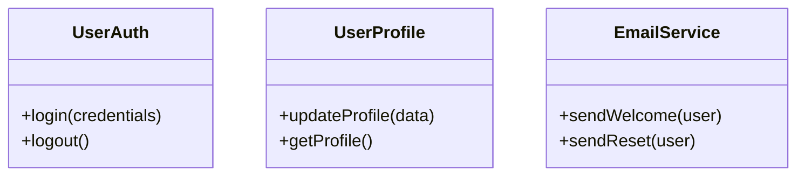

# SOLID-SRP — Single Responsibility Principle

**Layer:** 1 (universal)
**Categories:** software-design, maintainability
**Applies-to:** all
**Summary:** Each module or class must have exactly one reason to change, serving a single stakeholder or concern.

## Principle

A module, class, or function should have one, and only one, reason to change. Each unit of code is responsible to a single actor — a single stakeholder or group of stakeholders who can require it to change.

## Why it matters

When a class serves multiple stakeholders, a change for one can inadvertently break behaviour that another depends on. Mixed responsibilities create fragile code where unrelated concerns are coupled together, making every change risky and every test combinatorial.

## Violations to detect

- A class that mixes persistence logic with business rules (e.g., `UserService` both validates and saves users)
- A method that performs input validation, business logic, and sends notifications in one body
- A module that changes for unrelated reasons across sprints (billing changes alongside UI changes)
- God classes with dozens of methods spanning multiple domains
- A method that accepts boolean flags to switch between fundamentally different behaviours

## Inspection

- `find $TARGET -name "*.py" -o -name "*.js" -o -name "*.ts" -o -name "*.java" -o -name "*.go" -o -name "*.cs" | xargs wc -l 2>/dev/null | sort -rn | head -20` | MEDIUM | Largest source files by line count (>300 lines suggests multiple responsibilities)

## Good practice

Split each responsibility into its own class. The diagram and code below show a monolithic `User` class refactored into three focused classes — each owned by a different stakeholder.



```java
// Violation — one class, three reasons to change
class User {
    void login(Credentials c) { ... }
    void updateProfile(ProfileData d) { ... }
    void sendWelcomeEmail() { ... }
}

// Correct — each class has exactly one reason to change
class UserAuth {
    void login(Credentials c) { ... }
}
class UserProfile {
    void updateProfile(ProfileData d) { ... }
}
class EmailService {
    void sendWelcome(User u) { ... }
}
```

- Use the "one sentence without 'and'" test: if you need "and" to describe the class, it has too many responsibilities
- Group code by reason-to-change, not by technical layer

## Sources

- Martin, Robert C. *Agile Software Development: Principles, Patterns, and Practices*. Pearson, 2003. ISBN 978-0-13-597444-5. Chapter 8.
- Martin, Robert C. *Clean Architecture*. Prentice Hall, 2017. ISBN 978-0-13-449416-6. Chapter 7.
